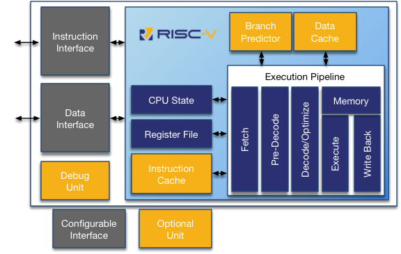
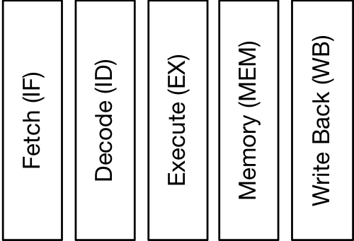
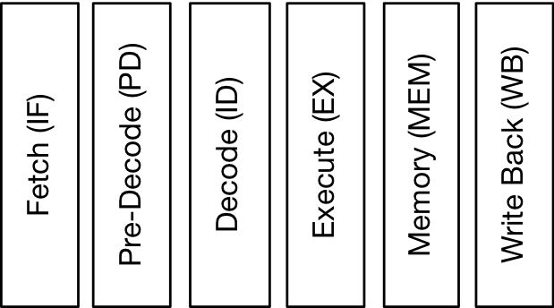
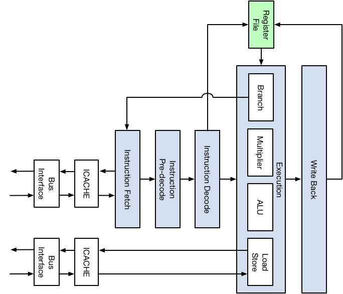
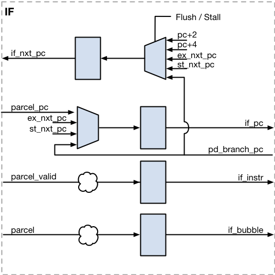
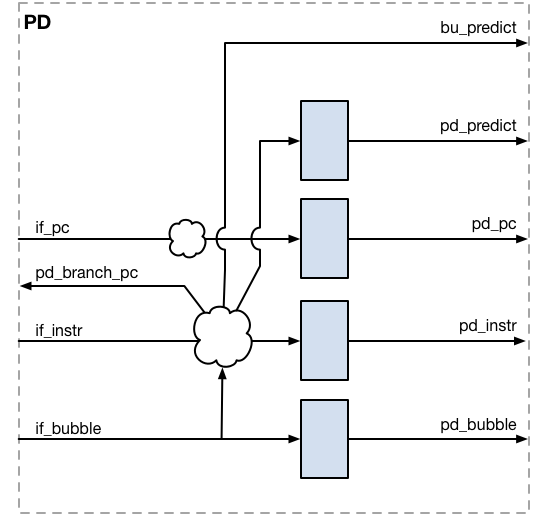
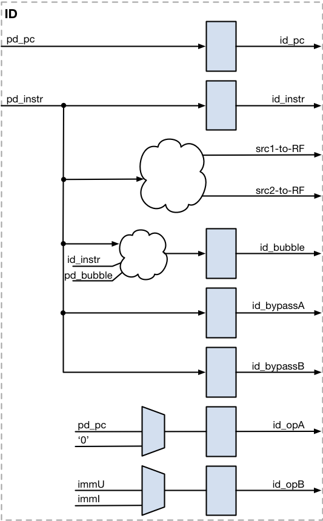
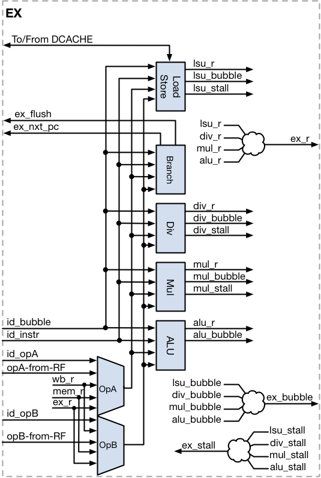
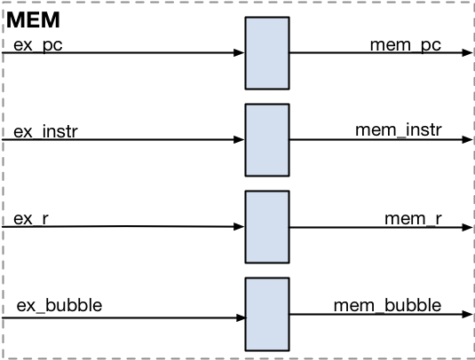
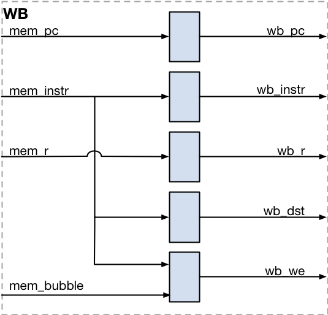

# RV12 RISC-V 32/64-bit CPU Core Datasheet

**Note:** Datasheet also available in [PDF Format](docs/RoaLogic_RV12_RISCV_Datasheet.pdf)

## Contents

-   [Product Brief](#product-brief)
-   [Introduction to the RV12](#introduction-to-the-rv12)
-   [RV12 Execution Pipeline](#rv12-execution-pipeline)
-   [Configurations](#configurations)
-   [Control and Status Registers](#control-and-status-registers)
-   [External Interfaces](#external-interfaces)
-   [Debug Unit](#debug-unit)
-   [Resources](#resources)
-   [Acknowledgements](#acknowledgements)
-   [Revision History](#revision-history)

## Product Brief

### Introduction

The RV12 is a highly configurable single-issue, single-core RV32I, RV64I compliant RISC CPU intended for the embedded market. The RV12 is a member of the Roa Logic’s 32/64bit CPU family based on the industry standard RISC-V instruction set.

The RV12 implements a Harvard architecture for simultaneous instruction and data memory accesses. It features an optimizing folded 6-stage pipeline, which optimizes overlaps between the execution and memory accesses, thereby reducing stalls and improving efficiency.

Optional features include Branch Prediction, Instruction Cache, Data Cache, Debug Unit and optional Multiplier/Divider Units. Parameterized and configurable features include the instruction and data interfaces, the branch-prediction-unit configuration, and the cache size, associativity, replacement algorithms and multiplier latency. Providing the user with trade offs between performance, power, and area to optimize the core for the application.

RV12 is compliant with the RISC-V User Level ISA v2.2 and Privileged Architecture v1.10 specifications published by the RISC-V Foundation ([www.riscv.org](http://www.riscv.org)).

### Features

**High Performance 32/64bit CPU**

-   Royalty Free Industry standard instruction set ([www.riscv.org](http://www.riscv.org))

-   Parameterized 32/64bit data

-   Fast, precise interrupts

-   Custom instructions enable integration of proprietary hardware accelerators

-   Single cycle execution

-   Optimizing folded 6-stage pipeline

-   Memory Protection Support

-   Optional/Parameterized branch-prediction-unit

-   Optional/Parameterized caches

**Highly Parameterized**

-   User selectable 32 or 64bit data

-   User selectable Branch Prediction Unit

-   User selectable instruction and/or data caches

-   User selectable cache size, structure, and architecture

-   Hardware Multiplier/Divider Support with user defined latency

-   Flexible bus architecture supporting AHB, Wishbone

**Size and power optimized design**

-   Fully parameterized design provides power/performance tradeoffs

-   Gated clock design to reduce power

-   Small silicon footprint; 30kgates for full featured implementation

**Industry standard software support**

-   Eclipse IDE for Windows/Linux

-   GNU Compiler Collection, debugger, linker, assembler

-   Architectural simulator

## Introduction to the RV12

The RISC-V specification provides for multi-threading and multi-core implementations. A core is defined as an implementation with its own instruction fetch unit. A hardware thread, or *hart*, is defined as a processing engine with its own state. A core may contain multiple hardware threads. See [www.riscv.org](http://www.riscv.org) for the specifications[1].

The RV12 implements a single core 32/64bit Reduced Instruction Set Computing (RISC) Central Processing Unit (CPU) with a single hardware thread, based on the RISC-V User Instruction Set Architecture v2.2 and Supervisor Instruction Set Architecture v1.10 specifications. The core is highly configurable, providing the user with a trade-off between area, power, and performance, thus allowing it to be optimized for the intended task.

See Configurations section for a description of the configuration options and parameters.

### Privilege Levels

At any time, a hardware thread (*hart*) is running at some privilege level. The current privilege level is encoded in one or more Control and Status Registers (CSRs). The RISC-V specification defines four privilege levels, where each level provides its own protection and isolation..

| Level | Encoding | Name             | Abbreviation |
|:-----:|:--------:|:-----------------|:------------:|
|   0   |   `00`   | User/Application |       U      |
|   1   |   `01`   | Supervisor       |       S      |
|   2   |   `10`   | Hypervisor       |       H      |
|   3   |   `11`   | Machine          |       M      |

The highest privilege level is the Machine level. This is an inherent trusted level and has access to, and can alter, the whole machine. The lowest level is the User/Application level and is considered the least trusted level. It is used to protect the rest of the system from malicious applications.

Supervisor mode is used to provide isolation between an operating system and the machine and user levels. Hypervisor mode is used to virtualize operating systems.

The RV12 always implements Machine mode and optionally implements User mode and parts of the Supervisor Mode.

### Execution Pipeline

The RV12 implements an optimizing 6-stage folded pipeline. The classic RISC pipeline consists of 5 stages; instruction fetch (IF), instruction decode (ID), execute (EX), memory access (MEM), and register write-back (WB).

The RV12 implements a modified form of the classic RISC pipeline where the Fetch stage takes 2 cycles to allow time to recode 16bit-compressed instructions and predict branches and jumps. The Memory stage is folded into the Execute and Write-Back stages. The Decode stage optimizes the instruction stream to allow CPU stalls, instruction execution, and memory accesses to overlap, thereby effectively hiding CPU stalls and improving the CPU’s cycles per instruction CPI.

The RV12 pipeline is capable of executing one instruction per clock cycle by overlapping the execution stages. The figure below shows how 5 instructions are being operated on at the same time; this is referred to as ‘being in flight’. Instruction A is the oldest instruction and it’s in the Write Back (WB) stage, whereas Instruction E is the newest instruction and it’s in the Instruction Fetch (IF) stage.

#### Instruction Fetch (IF)

During the Instruction Fetch stage one instruction is read from the instruction memory and the program counter is updated to point to the next instruction..

#### Instruction Pre-Decode (PD)

When RVC Support is enabled, the Instruction Pre-Decode stage decodes a 16bit-compressed instruction into a native 32bit instruction.

#### Instruction Decode (ID)

During the Instruction Decode stage the Register File is accessed and the bypass controls are determined.

#### Execute (EX)

During the Execute stage the result is calculated for an ALU, MUL, DIV instruction, the memory accessed for a Load/Store instruction, and branches and jumps are calculated and checked against their predicted outcomes.

#### Memory (MEM)

During the Memory stage, memory access by the pipeline is completed. Inclusion of this stage ensures high performance of the pipeline.

#### Write Back (WB)

During the Write Back stage the result from the Execution stage is written into the Register File.

### Branch Prediction Unit

The RV12 can execute one instruction every clock cycle. However due to the pipeline architecture each instruction takes several clock cycles to complete. When a branch instruction is decoded its conditions and outcome are not known and waiting for the branch outcome before continuing fetching new instructions would cause excessive processor stalls, affecting the processor’s performance.

Instead of waiting the processor predicts the branch’s outcome and continues fetching instructions from the predicted address. When a branch is predicted wrong, the processor must flush its pipeline and restart fetching from the calculated branch address. The processor’s state is not affected because the pipeline is flushed and therefore none of the incorrectly fetched instructions is actually executed. However the branch prediction may have forced the Instruction Cache to load new instructions. The Instruction Cache state is NOT restored, meaning the predicted instructions remain in the Instruction Cache.

The RV12 has an optional Branch Prediction Unit (BPU) that stores historical data to guide the processor in deciding if a particular branch is taken or not- taken. The BPU data is updated as soon as the branch executes.

The BPU has a number of parameters that determine its behavior. `HAS_BPU` determines if a BPU is present, `BPU_LOCAL_BITS` determines how many of the program counter’s LSB must be used and `BPU_GLOBAL_BITS` determines how many history bits must be used.

The combination of `BPU_GLOBAL_BITS` and `BPU_LOCAL_BITS` creates a vector that is used to address the Branch-Prediction-Table. Increasing the `BPU_LOCAL_BITS` increases the number of program counter entries, thereby reducing aliasing of the branch predictor at the expense of a larger Branch Prediction Table.

Setting `BPU_GLOBAL_BITS` to zero creates a local-predictor. Setting `BPU_GLOBAL_BITS` to any non-zero value adds history (previous branch prediction results) to the vector. This allows the branch predictor to handle nested branches. Increasing the number of `BPU_GLOBAL_BITS` adds more history to the vector at the expense of a larger Branch Prediction Table.

If no BPU is present, then all forward branches are predicted taken and all backward branches are predicted not-taken.

### Control & Status Registers (CSRs)

The Control & Status Registers, or CSRs for short, provide information about the current state of the processor. See section “Control & Status Registers”, for a description of the registers and their purpose.

### Debug Unit

The Debug Unit allows the Debug Environment to stall and inspect the CPU. Provided features include Single Step Tracing, Branch Tracing, and up to 8 Hardware Breakpoints.

### Data Cache

The Data Cache is used to speed up data memory accesses by buffering recently accessed memory locations. The data cache is capable of handling, byte, half-word, and word accesses when `XLEN=32`, as long as they are on their respective boundaries. It is capable of handling byte, half-word, word, and double-word accesses when `XLEN=64`, as long as they are on their respective boundaries. Accessing a memory location on a non-natural boundary (e.g. a word access on address 0x003) causes a data-load trap.

During a cache miss a complete block is written back to memory, if required, and a new block loaded is loaded into the cache. Setting `DCACHE_SIZE` to zero disables the Data Cache. Memory locations are then directly access via the Data Interface.

### Instruction Cache

The Instruction Cache is used to speed up instruction fetching by buffering recently fetched instructions. The Instruction Cache is capable of fetching one parcel per cycle on any 16bit boundary, but it cannot fetch across a block boundary. During a cache miss a complete block is loaded from instruction memory.

The Instruction Cache can be configured according to the user’s needs. The cache size, block length, associativity, and replacement algorithm are configurable.

Setting `ICACHE_SIZE` to zero disables the Instruction Cache. Parcels are then directly fetched from the memory via the Instruction Interface.

### Integer Pipeline

The RV12 has a single integer pipeline that can execute one instruction per cycle. The pipeline handles all logical, integer arithmetic, CSR access, and PC modifying instructions.

### Register File

The Register File is made up of 32 register locations (X0-X31) each XLEN bits wide. Register X0 is always zero. The Register File has two read ports and one write port.

## RV12 Execution Pipeline

The RV12 implements a 32/64bit Integer modified form of the classic RISC pipeline. The pipeline consists of the Instruction Fetch, Pre-Decode, Instruction Decode, Execution, Memory Access, and Write Back stages as highlighted in the figure below.

### Instruction Fetch (IF)

The Instruction Fetch unit loads a new parcel from the program memory. A parcel is a code field that contains one or more instructions. The address of the parcel to load is held by the Program Counter (PC). The Program Counter is either 32 or 64bits wide, depending on the XLEN parameter. The Program Counter is updated whenever the Instruction Pipeline is not stalled.

If the pipeline is flushed the Program Counter is restarted from the given address.

| **Signal**     | **Direction** |  **To/From**  | **Description**                              |
|:---------------|:-------------:|:-------------:|:---------------------------------------------|
| `if_nxt_pc`    |       to      | Bus Interface | Next address to fetch parcel from            |
| `parcel_pc`    |      from     | Bus Interface | Fetch parcel’s address                       |
| `parcel_valid` |      from     | Bus Interface | Valid indicators for parcel                  |
| `parcel`       |      from     | Bus Interface | Fetched parcel                               |
|                |               |               |                                              |
| `Flush`        |      from     |    EX/State   | When asserted flushes the pipe               |
| `Stall`        |      from     |       PD      | When asserted stalls the pipe                |
| `pd_branch_pc` |      from     |       PD      | New program counter for a branch instruction |
| `if_pc`        |       to      |       PD      | Instruction Fetch program counter            |
| `if_instr`     |       to      |       PD      | Instruction Fetch instruction                |
| `if_bubble`    |       to      |       PD      | Instruction Fetch bubble                     |
| `if_exception` |       to      |       PD      | Instruction Fetch exception status           |

### Pre-Decode (PD)

The Pre-Decode unit translates 16-bit compressed instructions to the base 32bit RISC-V instructions and then processes Program Counter modifying instructions like Jump-And-Link and Branch. This avoids waiting for the Execution stage to trigger the update and reduces the demand for pipeline flushes. The destination address for branches is predicted based on the data provided by the optional Branch Prediction Unit or determined statically based on the offset.

| **Signal**     | **Direction** | **To/From** | **Description**                               |
|:---------------|:-------------:|:-----------:|:----------------------------------------------|
| `if_pc`        |      from     |      IF     | Instruction Fetch program counter             |
| `if_instr`     |      from     |      IF     | Instruction Fetch instruction                 |
| `if_bubble`    |      from     |      IF     | Instruction Fetch bubble                      |
| `if_exception` |      from     |      IF     | Instruction Fetch exception status            |
| `pd_branch_pc` |       to      |      IF     | New PC (for a branch instruction)             |
|                |               |             |                                               |
| `bu_predict`   |      from     |      BP     | Branch prediction from Branch Prediction Unit |
| `pd_predict `  |       to      |      ID     | Forwarded branch prediction                   |
| `pd_pc`        |       to      |      ID     | Pre-Decode program counter                    |
| `pd_instr`     |       to      |      ID     | Pre-Decode instruction                        |
| `pd_bubble`    |       to      |      ID     | Pre-Decode bubble                             |
| `pd_exception` |       to      |      ID     | Pre-Decode exception status                   |

### Instruction Decode (ID)

The Instruction Decode unit ensures the operands for the execution units are available. It accesses the Register File, calculates immediate values, sets bypasses, and checks for illegal opcodes and opcode combinations.

| **Signal**     | **Direction** | **To/From** | **Description**                     |
|:---------------|:-------------:|:-----------:|:------------------------------------|
| `pd_pc`        |      from     |      PD     | Pre-Decode program counter          |
| `pd_instr`     |      from     |      PD     | Pre-Decode instruction              |
| `pd_bubble`    |      from     |      PD     | Pre-Decode bubble                   |
| `pd_exception` |      from     |      PD     | Pre-Decode exception status         |
|                |               |             |                                     |
| `src1`         |       to      |      RF     | Source Register1 index              |
| `src2`         |       to      |      RF     | Source Register2 Index              |
|                |               |             |                                     |
| `id_bypassA`   |       to      |      EX     | Bypass signals for srcA             |
| `id_bypassB`   |       to      |      EX     | Bypass signals for srcB             |
| `id_opA`       |       to      |      EX     | Calculated operandA                 |
| `id_opB`       |       to      |      EX     | Calculated operandB                 |
| `id_pc`        |       to      |      EX     | Instruction Decode program counter  |
| `id_instr`     |       to      |      EX     | Instruction Decode instruction      |
| `id_bubble`    |       to      |      EX     | Instruction Decode bubble           |
| `id_exception` |       to      |      EX     | Instruction Decode exception status |

### Execute (EX)

The Execute stage performs the required operation on the data provided by the Instruction Decode stage. The Execution stage has multiple execution units, each with a unique function. The ALU performs logical and arithmetic operations. The Multiplier unit calculates signed/unsigned multiplications. The Divider unit calculates signed/unsigned division and remainder. The Load-Store Unit accesses the data memory. The Branch Unit calculates jump and branch addresses and validates the predicted branches.

Only one operation can be executed per clock cycle. Most operations complete in one clock cycle, except for the divide instructions, which always take multiple clock cycles to complete. The multiplier supports configurable latencies, to improve performance.

| **Signal**     | **Direction** | **To/From** | **Description**                     |
|:---------------|:-------------:|:-----------:|:------------------------------------|
| `id_pc`        |      from     |      ID     | Instruction Decode program counter  |
| `id_instr`     |      from     |      ID     | Instruction Decode instruction      |
| `id_bubble`    |      from     |      ID     | Instruction Decode bubble           |
| `id_exception` |      from     |      ID     | Instruction Decode exception status |
|                |               |             |                                     |
| `opA`          |      from     |      RF     | Source Register1 value              |
| `opB`          |      from     |      RF     | Source Register2 value              |
|                |               |             |                                     |
| `id_bypassA`   |      from     |      ID     | Bypass signals for srcA             |
| `id_bypassB`   |      from     |      ID     | Bypass signals for srcB             |
| `id_opA`       |      from     |      ID     | Calculated operandA                 |
| `id_opB`       |      from     |      ID     | Calculated operandB                 |
| `ex_stall`     |       to      |      ID     | Stall ID (and higher) stages        |
| `ex_flush`     |       to      |   ID/PD/IF  | Flush ID (and higher) pipe stages   |
| `ex_r`         |       to      |     MEM     | Result from execution units         |
| `ex_pc`        |       to      |     MEM     | Execute program counter             |
| `ex_instr`     |       to      |     MEM     | Execute instruction                 |
| `ex_bubble`    |       to      |     MEM     | Execute bubble                      |
| `ex_exception` |       to      |     MEM     | Execute exception status            |

### Memory-Access (MEM)

The Memory Access stage waits for a memory read access to complete. When memory is accessed, address, data, and control signals are calculated during the Execute stage. The memory latches these signals and then performs the actual access. This means that read-data won’t be available until 1 clock cycle later. This would be at the end of the Write-Back stage, and hence too late. Therefore the Memory-Access stage is added.

| **Signal**      | **Direction** | **To/From** | **Description**                |
|:----------------|:-------------:|:-----------:|:-------------------------------|
| `ex_r`          |      from     |      EX     | Result from Execution stage    |
| `ex_pc`         |      from     |      EX     | Execute program counter        |
| `ex_instr`      |      from     |      EX     | Execute instruction            |
| `ex_bubble`     |      from     |      EX     | Execute bubble                 |
| `ex_exception`  |      from     |      EX     | Execute stage exception status |
|                 |               |             |                                |
| `mem_r`         |       to      |    WB/EX    | Memory Access result           |
| `mem_instr`     |       to      |    WB/ID    | Memory Access instruction      |
| `mem_bubble`    |       to      |    WB/ID    | Memory Access bubble           |
| `mem_exception` |       to      |   WB/ID/EX  | Memory Access exception status |

### Write-Back (WB)

The Write-Back stage writes the results from the Execution Units and memory-read operations into the Register File.

| **Signal**      | **Direction** | **To/From** | **Description**                 |
|:----------------|:-------------:|:-----------:|:--------------------------------|
| `mem_r`         |      from     |     MEM     | Result from Memory Access stage |
| `mem_pc`        |      from     |     MEM     | Memory Access program counter   |
| `mem_instr`     |      from     |     MEM     | Memory Access instruction       |
| `mem_exception` |      from     |     MEM     | Memory Access exception status  |
| `mem_bubble`    |      from     |     MEM     | Memory Access bubble            |
| `dmem_q`        |      from     | Data Memory | Result from Data Memory         |
| `dmem_ack`      |      from     | Data Memory | Data Memory acknowledge         |
|                 |               |             |                                 |
| `wb_r`          |       to      |   RF/ID/EX  | Result to be written to RF      |
| `wb_dst`        |       to      |      RF     | Destination register index      |
| `wb_we`         |       to      |      RF     | Write enable                    |
| `wb_pc`         |       to      |    State    | WriteBack program counter       |
| `wb_instr`      |       to      |   State/ID  | WriteBack instruction           |
| `wb_bubble`     |       to      |   State/ID  | WriteBack bubble                |
| `wb_exception`  |       to      | State/ID/EX | WriteBack exception status      |

## Configurations

### Introduction

The RV12 is a highly configurable 32 or 64bit RISC CPU. The core parameters and configuration options are described in this section.

### Core Parameters

| Parameter               |   Type  |     Default     | Description                                                      |
|:------------------------|:-------:|:---------------:|:-----------------------------------------------------------------|
| `JEDEC_BANK`            | Integer |       0x0A      | JEDEC Bank                                                       |
| `JEDEC_MANUFACTURER_ID` | Integer |       0x6E      | JEDEC Manufacturer ID                                            |
| `XLEN`                  | Integer |        32       | Datapath width                                                   |
| `PLEN`                  | Integer |      `XLEN`     | Physical Memory Address Size                                     |
| `PMP_CNT`               | Integer |        16       | Number of Physical Memory Protection Entries                     |
| `PMA_CNT`               | Integer |        16       | Number of Physical Menory Attribute Entries                      |
| `HAS_USER`              | Integer |        0        | User Mode Enable                                                 |
| `HAS_SUPER`             | Integer |        0        | Supervisor Mode Enable                                           |
| `HAS_HYPER`             | Integer |        0        | Hypervisor Mode Enable                                           |
| `HAS_RVM`               | Integer |        0        | “M” Extension Enable                                             |
| `HAS_RVA`               | Integer |        0        | “A” Extension Enable                                             |
| `HAS_RVC`               | Integer |        0        | “C” Extension Enable                                             |
| `HAS_BPU`               | Integer |        1        | Branch Prediction Unit Control Enable                            |
| `IS_RV32E`              | Integer |        0        | RV32E Base Integer Instruction Set Enable                        |
| `MULT_LATENCY`          | Integer |        0        | Hardware Multiplier Latency (if “M” Extension enabled)           |
| `ICACHE_SIZE`           | Integer |        16       | Instruction Cache size in Kbytes                                 |
| `ICACHE_BLOCK_SIZE`     | Integer |        32       | Instruction Cache block length in bytes                          |
| `ICACHE_WAYS`           | Integer |        2        | Instruction Cache associativity                                  |
| `ICACHE_REPLACE_ALG`    | Integer |        0        | Instruction Cache replacement algorithm 0: Random 1: FIFO 2: LRU |
| `DCACHE_SIZE`           | Integer |        16       | Data Cache size in Kbytes                                        |
| `DCACHE_BLOCK_SIZE`     | Integer |        32       | Data Cache block length in bytes                                 |
| `DCACHE_WAYS`           | Integer |        2        | Data Cache associativity                                         |
| `DCACHE_REPLACE_ALG`    | Integer |        0        | Data Cache replacement algorithm 0: Random 1: FIFO 2: LRU        |
| `HARTID`                | Integer |        0        | Hart Identifier                                                  |
| `PC_INIT`               | Address |      `h200`     | Program Counter Initialisation Vector                            |
| `MNMIVEC_DEFAULT`       | Address | `PC_INIT-‘h004` | Machine Mode Non-Maskable Interrupt vector address               |
| `MTVEC_DEFAULT`         | Address | `PC_INIT-‘h040` | Machine Mode Interrupt vector address                            |
| `HTVEC_DEFAULT`         | Address | `PC_INIT-‘h080` | Hypervisor Mode Interrupt vector address                         |
| `STVEC_DEFAULT`         | Address | `PC_INIT-‘h0C0` | Supervisor Mode Interrupt vector address                         |
| `UTVEC_DEFAULT`         | Address | `PC_INIT-‘h100` | User Mode Interrupt vector address                               |
| `BP_LOCAL_BITS`         | Integer |        10       | Number of local predictor bits                                   |
| `BP_GLOBAL_BITS`        | Integer |        2        | Number of global predictor bits                                  |
| `BREAKPOINTS`           | Integer |        3        | Number of hardware breakpoints                                   |
| `TECHNOLOGY`            |  String |    `GENERIC`    | Target Silicon Technology                                        |

#### JEDEC\_BANK and JEDEC\_MANUFACTURER\_ID

The `JEDEC_BANK` and `JEDEC_MANUFACTURER_ID` parameters together set the manufacturer ID of the RV12 core. The official Roa Logic JEDEC ID is:

`7F 7F 7F 7F 7F 7F 7F 7F 7F 6E`

This ID is specified via the `JEDEC_BANK` and `JEDEC_MANUFACTURER_ID` parameters as:

`JEDEC_BANK = 0x0A` (Corresponding to number of bytes)

`JEDEC_MANUFACTURER_ID = 0x6E` (Single byte JEDEC ID)

These parameters are then encoded into a single value stored in the `mvendorid` CSR per the RISC-V v1.10 Privileged Specification.

See branch prediction unit section for more details.

#### XLEN

The `XLEN` parameter specifies the width of the data path. Allowed values are either 32 or 64, for a 32bit or 64bit CPU respectively.

#### PC\_INIT

The `PC_INIT` parameter specifies the initialization vector of the Program Counter; i.e. the boot address, which by default is defined as address ‘h200

#### PLEN

The `PLEN` parameter specifies the physical address space the CPU can address. This parameter must be equal or less than XLEN. Using fewer bits for the physical address reduces internal and external resources. Internally the CPU still uses `XLEN`, but only the `PLEN` LSBs are used to address the caches and the external buses.

#### PMP\_CNT

The RISC-V specification supports up to 16 Physical Memory Protection Entries which are configured in software via the PMP CSRs. The `PMP_CNT` parameter specifies the number implemented in the RV12 processor, and must be set to a value of 16 or less. The default value is 16.

#### PMA\_CNT

The RV12 supports an unlimited number of Physically Protected Memory regions, the attributes for which are configured in hardware via the Physical Memory Attribute (PMA) Configuration and Address input ports. The `PMA_CNT` parameter specifies the number of regions supported; the defualt value is 16

#### HAS\_USER

The `HAS_USER` parameter defines if User Privilege Level is enabled (‘1’) or disabled (‘0’). The default value is disabled (‘0’).

#### HAS\_SUPER

The `HAS_SUPER` parameter defines if Supervisor Privilege Level is enabled (‘1’) or disabled (‘0’). The default value is disabled (‘0’).

#### HAS\_HYPER

The `HAS_HYPER` parameter defines if Hypervisor Privilege Level is enabled (‘1’) or disabled (‘0’). The default value is disabled (‘0’).

#### HAS\_RVM

The `HAS_RVM` parameter defines if the “M” Standard Extension for Integer Multiplication and Division is enabled (‘1’) or disabled (‘0’). The default value is disabled (‘0’).

#### HAS\_RVA

The `HAS_RVA` parameter defines if the “A” Standard Extension for Atomic Memory Instructions is enabled (‘1’) or disabled (‘0’). The default value is disabled (‘0’).

#### HAS\_RVC

The `HAS_RVC` parameter defines if the “C” Standard Extension for Compressed Instructions is enabled (‘1’) or disabled (‘0’). The default value is disabled (‘0’).

#### HAS\_BPU

The CPU has an optional Branch Prediction Unit that can reduce the branch penalty considerably by prediction if a branch is taken or not taken. The `HAS_BPU` parameter specifies if the core should generate a branch- predictor. Setting this parameter to 0 prevents the core from generating a branch-predictor. Setting this parameter to 1 instructs the core to generate a branch-predictor. The type and size of the branch-predictor is determined by the `BP_GLOBAL_BITS` and `BP_LOCAL_BITS` parameters.

See branch prediction unit section for more details.

#### IS\_RV12E

RV12 supports the RV32E Base Integer Instruction Set, Version 1.9. RV32E is a reduced version of RV32I designed for embedded systems, reducing the number of integer registers to 16. The `IS_RV12E` parameter determines if this feature is enabled (‘1’) or disabled (‘0’). The default value is disabled (‘0’).

#### MULT\_LATENCY

If the “M” Standard Extension for Integer Multiplication and Division is enabled via the `HAS_RVM` parameter (`HAS_RVM=1` See section 4.2.7), a hardware multiplier will be generated to support these instructions. By default (i.e. when `MULT_LATENCY=0`) the generated multiplier will be built as a purely combinatorial function.

The performance of the hardware multiplier may be improved at the expense of increased latency of 1, 2 or 3 clock cycles by defining `MULT_LATENCY` to 1, 2 or 3 respectively.

If the “M” Standard Extension is *not* enabled (`HAS_RVM=0`) then the MULT\_LATENCY parameter has no effect on the RV12 implementation.

#### BPU\_LOCAL\_BITS

The CPU has an optional Branch Prediction Unit that can reduce the branch penalty considerably by prediction if a branch is taken or not taken. The `BPU_LOCAL_BITS` parameter specifies how many bits from the program counter should be used for the prediction.

This parameter only has an effect if `HAS_BPU=1`.

See branch prediction unit section for more details.

#### BPU\_GLOBAL\_BITS

The CPU has an optional Branch Prediction Unit that can reduce the branch penalty considerably by prediction if a branch is taken or not-taken. The `BPU_GLOBAL_BITS` parameter specifies how many history bits should be used for the prediction.

This parameter only has an effect if `HAS_BPU=1`.

See branch prediction unit section for more details.

#### HARTID

The RV12 is a single thread CPU, for which each instantiation requires a hart identifier (`HARTID`), which must be unique within the overall system. The default `HARTID` is 0, but may be set to any integer.

#### ICACHE\_SIZE

The CPU has an optional instruction cache. The `ICACHE_SIZE` parameter specifies the size of the instruction cache in Kbytes. Setting this parameter to 0 prevents the core from generating an instruction cache.

See instruction cache section for more details.

#### ICACHE\_BLOCK\_LENGTH

The CPU has an optional instruction cache. The `ICACHE_BLOCK_LENGTH` parameter specifies the number of bytes in one cache block.

See instruction cache section for more details.

#### ICACHE\_WAYS

The CPU has an optional instruction cache. The `ICACHE_WAYS` parameter specifies the associativity of the cache. Setting this parameter to 1 generates a direct mapped cache, setting it to 2 generates a 2-way set associative cache, setting it to 4 generates a 4-way set associative cache, etc.

See instruction cache section for more details. See section \[instruction-cache\] for more details.

#### ICACHE\_REPLACE\_ALG

The CPU has an optional instruction cache. The `ICACHE_REPLACE_ALG` parameter specifies the algorithm used to select which block will be replaced during a block-fill.

See instruction cache section for more details. See section \[instruction-cache\] for more details.

#### DCACHE\_SIZE

The CPU has an optional data cache. The DCACHE\_SIZE parameter specifies the size of the instruction cache in Kbytes. Setting this parameter to ‘0’ prevents the core from generating a data cache.

See data cache section for more details.

#### DCACHE\_BLOCK\_LENGTH

The CPU has an optional data cache. `The DCACHE_BLOCK_LENGTH` parameter specifies the number of bytes in one cache block.

See data cache section for more details.

#### DCACHE\_WAYS

The CPU has an optional data cache. The `DCACHE_WAYS` parameter specifies the associativity of the cache. Setting this parameter to 1 generates a direct mapped cache, setting it to 2 generates a 2-way set associative cache, setting it to 4 generates a 4-way set associative cache, etc.

See data cache section for more details.

#### DCACHE\_REPLACE\_ALG

The CPU has an optional instruction cache. The `DCACHE_REPLACE_ALG` parameter specifies the algorithm used to select which block will be replaced during a block-fill.

See data cache section for more details.

#### BREAKPOINTS

The CPU has a debug unit that connects to an external debug controller. The `BREAKPOINTS` parameter specifies the number of implemented hardware breakpoints. The maximum is 8.

#### TECHNOLOGY

The `TECHNOLOGY` parameter defines the target silicon technology and may be one of the following values:

| Parameter Value | Description                       |
|:---------------:|:----------------------------------|
|    `GENERIC`    | Behavioural Implementation        |
|      `N3X`      | eASIC Nextreme-3 Structured ASIC  |
|      `N3XS`     | eASIC Nextreme-3S Structured ASIC |

Note: the parameter value is not case-sensitive.

#### MNMIVEC\_DEFAULT

The `MNMIVEC_DEFAULT` parameter defines the Machine Mode non-maskable interrupt vector address. The default vector is defined relative to the Program Counter Initialisation vector `PC_INIT` as follows:

`MNMIVEC_DEFAULT = PC_INIT - ’h004`

#### MTVEC\_DEFAULT

The `MTVEC_DEFAULT` parameter defines the interrupt vector address for the Machine Privilege Level. The default vector is defined relative to the Program Counter Initialisation vector `PC_INIT` as follows:

`MTVEC_DEFAULT = PC_INIT - ’h040`

#### HTVEC\_DEFAULT

The `HTVEC_DEFAULT` parameter defines the interrupt vector address for the Hypervisor Privilege Level. The default vector is defined relative to the Program Counter Initialisation vector `PC_INIT` as follows:

`HTVEC_DEFAULT = PC_INIT - ’h080`

#### STVEC\_DEFAULT

The `STVEC_DEFAULT` parameter defines the interrupt vector address for the Supervisor Privilege Level. The default vector is defined relative to the Program Counter Initialisation vector `PC_INIT` as follows:

`STVEC_DEFAULT = PC_INIT - ’h0C0`

#### UTVEC\_DEFAULT

The `UTVEC_DEFAULT` parameter defines the interrupt vector address for the User Privilege Level. The default vector is defined relative to the Program Counter Initialisation vector `PC_INIT` as follows:

`UTVEC_DEFAULT = PC_INIT - ’h100`

## Control and Status Registers

### Introduction

The state of the CPU is maintained by the Control & Status Registers (CSRs). They determine the feature set, set interrupts and interrupt masks, and determine the privilege level. The CSRs are mapped into an internal 12bit address space and are accessible using special commands.

### Accessing the CSRs

The CSRRW (Atomic Read/Write CSR) instruction atomically swaps values in the CSRs and integer registers. CSRRW reads the old value of the CSR, zero-extends the value to XLEN bits, and writes it to register *rd*. The initial value in register *rs1* is written to the CSR.

The CSRRS (Atomic Read and Set CSR) instruction reads the old value of the CSR, zero-extends the value to XLEN bits, and writes it to register *rd*. The initial value in register *rs1* specifies the bit positions to be set in the CSR. Any bit that is high in *rs1* will be set in the CSR, assuming that bit can be set. The effect is a logic OR between the old value in the CSR and the new value in *rs1*.

If *rs1*=X0, then the CSR is not written to.

The CSRRC (Atomic Read and Clear CSR) instruction reads the old value of the CSR, zero-extends the value to XLEN bits, and writes it to register *rd*. The initial value in register *rs1* specifies the bit positions to be cleared in the CSR. Any bit that is high in *rs1* will be cleared in the CSR, assuming that bit can be cleared. If *rs1*=X0, then the CSR is not written to.

The CSRRWI, CSRRSI, and CSRRCI commands are similar in behavior. Except that they update the CSR using an immediate value, instead of referencing a source register. The immediate value is obtained by zero-extending the 5bit *zimm* field. If *zimm\[4:0\]* is zero, then the CSR is not written to.

### Illegal CSR accesses

Depending on the privilege level some CSRs may not be accessible. Attempts to access a non-existing CSR raise an illegal-instruction exception. Attempts to access a privileged CSR or write a read-only CSR raise an illegal-instruction exception. Machine Mode can access all CSRs, whereas User Mode can only access a few.

### Timers and Counters

The RV12 provides a number of 64-bit read-only user-level counters, which are mapped into the 12-bit CSR address space and accessed in 32-bit pieces using CSRRS instructions.

The RDCYCLE pseudo-instruction reads the low XLEN bits of the cycle CSR that holds a count of the number of clock cycles executed by the processor on which the hardware thread is running from an arbitrary start time in the past. RDCYCLEH is an RV32I-only instruction that reads bits 63–32 of the same cycle counter. The rate at which the cycle counter advances will depend on the implementation and operating environment.

The RDTIME pseudo-instruction reads the low XLEN bits of the time CSR, which counts wall-clock real time that has passed from an arbitrary start time in the past. RDTIMEH is an RV32I-only instruction that reads bits 63–32 of the same real-time counter. The underlying 64-bit counter should never overflow in practice. The execution environment should provide a means of determining the period of the real-time counter (seconds/tick). The period must be constant. The real-time clocks of all hardware threads in a single user application should be synchronized to within one tick of the real-time clock. The environment should provide a means to determine the accuracy of the clock.

The RDINSTRET pseudo-instruction reads the low XLEN bits of the instret CSR, which counts the number of instructions retired by this hardware thread from some arbitrary start point in the past. RDINSTRETH is an RV32I-only instruction that reads bits 63–32 of the same instruction counter.

In RV64I, the CSR instructions can manipulate 64-bit CSRs. In particular, the RDCYCLE, RDTIME, and RDINSTRET pseudo-instructions read the full 64 bits of the cycle, time, and instret counters. Hence, the RDCYCLEH, RDTIMEH, and RDINSTRETH instructions are not necessary and are illegal in RV64I.

### CSR Listing

The following sections describe each of the register functions as specifically implemented in RV12.

Note: These descriptions are derived from “The RISC-V Instruction Set Manual, Volume II: Privileged Architecture, Version 1.10", Editors Andrew Waterman and Krste Asanović, RISC-V Foundation, May 7, 2017, and released under the Creative Commons Attribution 4.0 International License

| **Address** | **Privilege** | **Name**         | **Description**                               |
|:-----------:|:-------------:|:-----------------|:----------------------------------------------|
|    0xF11    |      MRO      | `mvendorid`      | Vendor ID                                     |
|    0xF12    |      MRO      | `marchid`        | Architecture ID                               |
|    0xF13    |      MRO      | `mimpid`         | Implementation ID                             |
|    0xF14    |      MRO      | `mhartid`        | Hardware thread ID                            |
|    0x300    |      MRW      | `mstatus`        | Machine status register                       |
|    0x301    |      MRW      | `misa`           | ISA and extensions                            |
|    0x302    |      MRW      | `medeleg`        | Machine exception delegation register         |
|    0x303    |      MRW      | `mideleg`        | Machine interrupt delegation register         |
|    0x304    |      MRW      | `mie`            | Machine interrupt-enable register             |
|    0x305    |      MRW      | `mtvec`          | Machine trap-handler base address             |
|    0x306    |      MRW      | `mcounteren`     | Machine counter enable                        |
|    0x7c0    |      MRW      | `mnmivec`        | Machine non-maskable interrupt vector         |
|    0x340    |      MRW      | `mscratch`       | Scratch register for machine trap handler     |
|    0x341    |      MRW      | `mepc`           | Machine exception program counter             |
|    0x342    |      MRW      | `mcause`         | Machine trap cause                            |
|    0x343    |      MRW      | `mtval`          | Machine bad address or instruction            |
|    0x344    |      MRW      | `mip`            | Machine interrupt pending                     |
|    0xB00    |      MRW      | `mcycle`         | Machine cycle counter                         |
|    0xB02    |      MRW      | `minstret`       | Machine instructions-retired counter          |
|    0xB03    |      MRW      | `mhpmcounter3`   | Machine performance-monitoring counter        |
|    0xB04    |      MRW      | `mhpmcounter4`   | Machine performance-monitoring counter        |
|             |               |                  |                                               |
|    0xB1F    |      MRW      | `mhpmcounter31`  | Machine performance-monitoring counter        |
|    0xB80    |      MRW      | `mcycleh`        | Upper 32 bits of `mcycle`, RV32I only         |
|    0xB82    |      MRW      | `minstreth`      | Upper 32 bits of `minstret`, RV32I only       |
|    0xB83    |      MRW      | `mhpmcounter3h`  | Upper 32 bits of mhpmcounter3, RV32I only     |
|    0xB84    |      MRW      | `mhpmcounter4h`  | Upper 32 bits of mhpmcounter4, RV32I only     |
|             |               |                  |                                               |
|    0xB9F    |      MRW      | `mhpmcounter31h` | Upper 32 bits of mhpmcounter31, RV32I only    |
|    0x323    |      MRW      | `mhpevent3`      | Machine performance-monitoring event selector |
|    0x324    |      MRW      | `mhpevent4`      | Machine performance-monitoring event selector |
|             |               |                  |                                               |
|    0x33F    |      MRW      | `mhpevent31`     | Machine performance-monitoring event selector |

| **Address** | **Privilege** | **Name**     | **Description**                          |
|:-----------:|:-------------:|:-------------|:-----------------------------------------|
|    0x100    |      SRW      | `sstatus`    | Supervisor status register               |
|    0x102    |      SRW      | `sedeleg`    | Supervisor exception delegation register |
|    0x103    |      SRW      | `sideleg`    | Supervisor interrupt delegation register |
|    0x104    |      SRW      | `sie`        | Supervisor interrupt-enable register     |
|    0x105    |      SRW      | `stvec`      | Supervisor trap handler base address     |
|    0x106    |      SRW      | `scounteren` | Supervisor counter enable                |
|    0x140    |      SRW      | `sscratch`   | Scratch register for trap handler        |
|    0x141    |      SRW      | `sepc`       | Supervisor exception program counter     |
|    0x142    |      SRO      | `scause`     | Supervisor trap cause                    |
|    0x143    |      SRO      | `sbadaddr`   | Supervisor bad address                   |
|    0x144    |      SRW      | `sip`        | Supervisor interrupt pending register    |

| **Address** | **Privilege** | **Name**        | **Description**                            |
|:-----------:|:-------------:|:----------------|:-------------------------------------------|
|    0x000    |      URW      | `ustatus`       | User status register                       |
|    0x004    |      URW      | `uie`           | User interrupt-enable register             |
|    0x005    |      URW      | `utvec`         | User trap-handler base address             |
|    0x040    |      URW      | `uscratch`      | Scratch register for User trap handler     |
|    0x041    |      URW      | `uepc`          | User exception program counter             |
|    0x042    |      URW      | `ucause`        | User trap cause                            |
|    0x043    |      URW      | `utval`         | User bad address                           |
|    0x044    |      URW      | `uip`           | User interrupt pending                     |
|    0xC00    |      URO      | `cycle`         | Cycle counter for `RDCYCLE` instruction    |
|    0xC01    |      URO      | `time`          | Timer for RDTIME instruction               |
|    0xC02    |      URO      | `instret`       | Instruction-retire counter for `RDINSTRET` |
|    0xC03    |      URO      | `hpmcounter3`   | Performance-monitoring counter             |
|    0xC04    |      URO      | `hpmcounter4`   | Performance-monitoring counter             |
|             |               |                 |                                            |
|    0xC1F    |      URO      | `hpmcounter31`  | Performance-monitoring counter             |
|    0xC80    |      URO      | `cycleh`        | Upper 32bits of `cycle`, RV32I only        |
|    0xC81    |      URO      | `timeh`         | Upper 32bits of `time`, RV32I only         |
|    0xC82    |      URO      | `instreth`      | Upper 32bit of `instret`, RV32I only       |
|    0xC83    |      URO      | `hpmcounter3h`  | Upper 32bit of `hpmcounter3`, RV32I only   |
|    0xC84    |      URO      | `hpmcounter4h`  | Upper 32bit of `hpmcounter4`, RV32I only   |
|             |               |                 |                                            |
|    0xC9F    |      URO      | `hpmcounter31h` | Upper 32bit of `hpmcounter31`, RV32I only  |

| **Address** | **Privilege** | **Name**    | **Description**                                     |
|:-----------:|:-------------:|:------------|:----------------------------------------------------|
|    0x3A0    |      MRW      | `pmpcfg0`   | Physical memory protection configuration            |
|    0x3A1    |      MRW      | `pmpcfg1`   | Physical memory protection configuration, RV32 Only |
|    0x3A2    |      MRW      | `pmpcfg2`   | Physical memory protection configuration            |
|    0x3A3    |      MRW      | `pmpcfg3`   | Physical memory protection configuration,RV32 Only  |
|    0x3B0    |      MRW      | `pmpaddr0`  | Physical memory protection address register         |
|    0x3B1    |      MRW      | `pmpaddr1`  | Physical memory protection address register         |
|             |               |             |                                                     |
|    0x3BF    |      MRW      | `pmpaddr15` | Physical memory protection address register         |

### Machine Level CSRs

In addition to the machine-level CSRs described in this section, M-mode can access all CSRs at lower privilege levels.

#### Machine ISA Register (`misa`)

The `misa` register is an XLEN-bit WARL read-write register reporting the ISA supported by the hart.

The extensions field encodes the presence of the standard extensions, with a single bit per letter of the alphabet (bit 0 encodes the presence of extension “A”, bit 1 encodes the presence of extension “B”, through to bit 25 that encodes the presence of extension “Z”).

The “I” bit will be set for RV32I and RV64I base ISAs, and the “E” bit will be set for RV32E.

The Base field encodes the native base integer ISA width as shown:

| Value | Description |
|:-----:|:-----------:|
|   1   |      32     |
|   2   |      64     |

#### Vendor ID Register (`mvendorid`)

The `mvendorid` read-only register is an XLEN-bit register encoding the JEDEC manufacturer ID of the provider of the core.

The Roa Logic JEDEC ID is:

`7F 7F 7F 7F 7F 7F 7F 7F 7F 6E`

This ID is specified via the `JEDEC_BANK` and `JEDEC_MANUFACTURER_ID` configuration parameters

`mvendorid` encodes the number of one-byte continuation codes of the `JEDEC_BANK` parameter in the Bank field, and encodes the final `JEDEC_MANUFACTURER_ID` byte in the Offset field, discarding the parity bit.

For the Roa Logic JEDEC manufacturer ID, this translates as:

`mvendorid` = {`JEDEC_BANK-1`, `JEDEC_MANUFACTURER_ID[6:0]`} = 0x4EE

#### Architecture ID Register (`marchid`)

The `marched` CSR is an XLEN-bit read-only register encoding the base microarchitecture of the hart. For the RV12 CPU this is defined as:

The Architecture ID for the RV12 CPU is defined as 0x12.

Note: Open-source project architecture IDs are allocated globally by the RISC-V Foundation, and have non-zero architecture IDs with a zero most-significant-bit (MSB). Commercial architecture IDs are allocated by each commercial vendor independently and have the MSB set.

#### Implementation ID Register (`mimpid`)

`mimpid` is an XLEN-sized read-only register provides hardware version information for the CPU.

The RISC-V specification calls for the contents of `mimpid` to be defined by the supplier/developer of the CPU core. In the Roa Logic implementation, this register is used to define the User Specification, Privilege Specification and Extension Specifications supported by that specific version of the RV12 core.

The value held within the `mimpid` CSR is an integer denoting Specification and Extension support as defined in the following table:

| `mimpid` | User Spec. | Privilege Spec. | A-Ext. | C-Ext. | M-Ext. |
|:--------:|:----------:|:---------------:|:------:|:------:|:------:|
|     0    |    v2.2    |      v1.10      |  v2.0  |    –   |  v2.0  |
|     1    |    v2.2    |      v1.10      |  v2.0  |  v1.7  |  v2.0  |
|     2    |    v2.2    |      v1.11      |  v2.0  |  v1.7  |  v2.0  |

#### Hardware Thread ID Register (`mhartid`)

The `mhartid` read-only register indicates the hardware thread that is running the code. The RV12 implements a single thread, therefore this register always reads zero.

#### Machine Status Register (mstatus)

The mstatus register is an XLEN-bit read/write register formatted as shown in Figure \[mstatusreg-rv32\] for RV32 and Figure \[mstatusreg\] for RV64. The mstatus register keeps track of and controls the hart’s current operating state. Restricted views of the mstatus register appear as the sstatus and ustatus registers in the S-level and U-level ISAs respectively.

#### Privilege and Global Interrupt-Enable Stack in mstatus register

Interrupt-enable bits, MIE, SIE, and UIE, are provided for each privilege mode. These bits are primarily used to guarantee atomicity with respect to interrupt handlers at the current privilege level. When a hart is executing in privilege mode *x*, interrupts are enabled when *x*IE=1. Interrupts for lower privilege modes are always disabled, whereas interrupts for higher privilege modes are always enabled. Higher-privilege-level code can use separate per-interrupt enable bits to disable selected interrupts before ceding control to a lower privilege level.

To support nested traps, each privilege mode *x* has a two-level stack of interrupt-enable bits and privilege modes. *x*PIE holds the value of the interrupt-enable bit active prior to the trap, and *x*PP holds the previous privilege mode. The *x*PP fields can only hold privilege modes up to *x*, so MPP is two bits wide, SPP is one bit wide, and UPP is implicitly zero. When a trap is taken from privilege mode *y* into privilege mode  *x*, *x*PIE is set to the value of *x*IE; *x*IE is set to 0; and *x*PP is set to *y*.

The MRET, SRET, or URET instructions are used to return from traps in M-mode, S-mode, or U-mode respectively. When executing an *x*RET instruction, supposing *x*PP holds the value *y*, *x*IE is set to *x*PIE; the privilege mode is changed to *y*; *x*PIE is set to 1; and *x*PP is set to U (or M if user-mode is not supported).

*x*PP fields are  fields that need only be able to store supported privilege modes, including *x* and any implemented privilege mode lower than *x*.

User-level interrupts are an optional extension and have been allocated the ISA extension letter N. If user-level interrupts are omitted, the UIE and UPIE bits are hardwired to zero. For all other supported privilege modes *x*, the *x*IE and *x*PIE must not be hardwired.

#### Base ISA Control in mstatus Register

For RV64 systems, the SXL and UXL fields are  fields that control the value of XLEN for S-mode and U-mode, respectively. The encoding of these fields is the same as the MXL field of misa. The effective XLEN in S-mode and U-mode are termed *S-XLEN* and *U-XLEN*, respectively.

For RV32 systems, the SXL and UXL fields do not exist, and S-XLEN = 32 and U-XLEN = 32.

#### Memory Privilege in mstatus Register

The MPRV (Modify PRiVilege) bit modifies the privilege level at which loads and stores execute in all privilege modes. When MPRV=0, translation and protection behave as normal. When MPRV=1, load and store memory addresses are translated and protected as though the current privilege mode were set to MPP. Instruction address-translation and protection are unaffected. MPRV is hardwired to 0 if U-mode is not supported.

The MXR (Make eXecutable Readable) bit modifies the privilege with which loads access virtual memory. When MXR=0, only loads from pages marked readable will succeed. When MXR=1, loads from pages marked either readable or executable (R=1 or X=1) will succeed. MXR is hardwired to 0 if S-mode is not supported.

The SUM (permit Supervisor User Memory access) bit modifies the privilege with which S-mode loads, stores, and instruction fetches access virtual memory. When SUM=0, S-mode memory accesses to pages that are accessible by U-mode will fault. When SUM=1, these accesses are permitted. SUM has no effect when page-based virtual memory is not in effect. Note that, while SUM is ordinarily ignored when not executing in S-mode, it *is* in effect when MPRV=1 and MPP=S. SUM is hardwired to 0 if S-mode is not supported.

##### Virtualization Management & Context Extension Fields in `mstatus` Register 

Virtualization and Context Extensions are not supported by the RV12 v1.x implementation. The value of these fields will therefore be permanently set to 0.

#### Machine Trap-Handler Base Address Register (`mtvec`)

The `mtvec` register is an XLEN-bit read/write register that holds trap vector configuration, consisting of a vector base address (BASE) and a vector mode (MODE).

The encoding of the MODE field is shown in Table \[mtvec-mode\]. When MODE=Direct, all traps into machine mode cause the `pc` to be set to the address in the BASE field. When MODE=Vectored, all synchronous exceptions into machine mode cause the `pc` to be set to the address in the BASE field, whereas interrupts cause the `pc` to be set to the address in the BASE field plus four times the interrupt cause number.

|  Value|   Name   | Description                                       |
|------:|:--------:|:--------------------------------------------------|
|      0|  Direct  | All exceptions set `pc` to BASE.                  |
|      1| Vectored | Asynchronous interrupts set `pc` to BASE+4×cause. |
|     ≥2|     —    | *Reserved*                                        |

#### Machine Delegation Registers (`medeleg` & `mideleg`)

The machine exception delegation register (`medeleg`) and machine interrupt delegation register (`mideleg`) are XLEN-bit read/write registers used to indicate that certain exceptions and interrupts should be processed directly by a lower privilege level.

When a trap is delegated to a less-privileged mode *x*, the *x*`cause` register is written with the trap cause; the *x*`epc` register is written with the virtual address of the instruction that took the trap; the *x*PP field of `mstatus` is written with the active privilege mode at the time of the trap; the *x*PIE field of `mstatus` is written with the value of the active interrupt-enable bit at the time of the trap; and the *x*IE field of `mstatus` is cleared. The `mcause` and `mepc` registers and the MPP and MPIE fields of `mstatus` are not written.

`medeleg` has a bit position allocated for every synchronous exception with the index of the bit position equal to the value returned in the `mcause` register (i.e. setting bit 8 allows user-mode environment calls to be delegated to a lower-privilege trap handler).

`mideleg` holds trap delegation bits for individual interrupts, with the layout of bits matching those in the `mip` register (i.e. `STIP` interrupt delegation control is located in bit 5).

#### Machine Interrupt Registers (`mie`, `mip`)

The `mip` register is an XLEN-bit read/write register containing information on pending interrupts, while `mie` is the corresponding XLEN- bit read/write register containing interrupt enable bits. Only the bits corresponding to lower-privilege software interrupts (USIP, SSIP), timer interrupts (UTIP, STIP), and external interrupts (UEIP, SEIP) in `mip` are writable through this CSR address; the remaining bits are read-only.

Restricted views of the `mip` and `mie` registers appear as the `sip`/`sie`, and `uip`/`uie` registers in S-mode and U-mode respectively. If an interrupt is delegated to privilege mode *x* by setting a bit in the `mideleg` register, it becomes visible in the *x*`ip` register and is maskable using the *x*`ie` register. Otherwise, the corresponding bits in *x*`ip` and *x*`ie` appear to be hardwired to zero.

The MTIP, STIP, UTIP bits correspond to timer interrupt-pending bits for machine, supervisor, and user timer interrupts, respectively. The MTIP bit is read-only and is cleared by writing to the memory-mapped machine-mode timer compare register. The UTIP and STIP bits may be written by M-mode software to deliver timer interrupts to lower privilege levels. User and supervisor software may clear the UTIP and STIP bits with calls to the AEE and SEE respectively.

There is a separate timer interrupt-enable bit, named MTIE, STIE, and UTIE for M-mode, S-mode, and U-mode timer interrupts respectively.

Each lower privilege level has a separate software interrupt-pending bit (SSIP, USIP), which can be both read and written by CSR accesses from code running on the local hart at the associated or any higher privilege level. The machine-level MSIP bits are written by accesses to memory-mapped control registers, which are used by remote harts to provide machine-mode interprocessor interrupts.

The MEIP field in `mip` is a read-only bit that indicates a machine-mode external interrupt is pending. MEIP is set and cleared by a platform-specific interrupt controller. The MEIE field in `mie` enables machine external interrupts when set.

The SEIP field in `mip` contains a single read-write bit. SEIP may be written by M-mode software to indicate to S-mode that an external interrupt is pending.

The UEIP field in `mip` provides user-mode external interrupts when the N extension for user-mode interrupts is implemented. It is defined analogously to SEIP.

The MEIE, SEIE, and UEIE fields in the `mie` CSR enable M-mode external interrupts, S-mode external interrupts, and U-mode external interrupts, respectively.

For all the various interrupt types (software, timer, and external), if a privilege level is not supported, the associated pending and interrupt-enable bits are hardwired to zero in the `mip` and `mie` registers respectively.

An interrupt *i* will be taken if bit *i* is set in both `mip` and `mie`, and if interrupts are globally enabled. By default, M-mode interrupts are globally enabled if the hart’s current privilege mode is less than M, or if the current privilege mode is M and the MIE bit in the `mstatus` register is set. If bit *i* in `mideleg` is set, however, interrupts are considered to be globally enabled if the hart’s current privilege mode equals the delegated privilege mode (S or U) and that mode’s interrupt enable bit (SIE or UIE in `mstatus`) is set, or if the current privilege mode is less than the delegated privilege mode.

Multiple simultaneous interrupts and traps at the same privilege level are handled in the following decreasing priority order: external interrupts, software interrupts, timer interrupts, then finally any synchronous traps.

#### Machine Non-Maskable Interrupt Vector (`mnmivec`)

The mnmivec register is an XLEN-bit read/write register that holds the base address of the non-maskable interrupt trap vector. When an exception occurs, the pc is set to mnmivec.

#### Machine Trap Handler Scratch Register (`mscratch`)

The `mscratch` register is an XLEN-bit read/write register dedicated for use by machine mode. It is used to hold a pointer to a machine-mode hart-local context space and swapped with a user register upon entry to an M-mode trap handler.

#### Machine Exception Program Counter Register (`mepc`)

`mepc` is an XLEN-bit read/write register. The two low bits (mepc\[1:0\]) are always zero.

When a trap is taken, `mepc` is written with the virtual address of the instruction that encountered the exception.

#### Machine Trap Cause Register (`mcause`)

The `mcause` register is an XLEN-bit read-write register. The Interrupt bit is set if the exception was caused by an interrupt. The Exception Code field contains a code identifying the last exception. The remaining center bits will read zero

See PDF Datasheet for further details

#### Machine Trap Value Register (`mtval`)

The `mtval` register is an XLEN-bit read-write register formatted as shown in Figure \[fig:mtvalreg\].

When a trap is taken into M-mode, `mtval` is written with exception-specific information to assist software in handling the trap. Otherwise, `mtval` is never written by the implementation, though it may be explicitly written by software.

When a hardware breakpoint is triggered, or an instruction-fetch, load, or store address-misaligned, access, or page-fault exception occurs, `mtval` is written with the faulting effective address. On an illegal instruction trap, `mtval` is written with the first XLEN bits of the faulting instruction as described below. For other exceptions, `mtval` is set to zero, but a future standard may redefine `mtval`’s setting for other exceptions.

For instruction-fetch access faults with variable-length instructions, `mtval` will point to the portion of the instruction that caused the fault while `mepc` will point to the beginning of the instruction.

#### Counter-Enable Registers (`[m|s]counteren`)

Note: Machine performnce counters are currently unsupported and therefore all HPM*n* bits are hardwired to ’0’.

The counter-enable registers `mcounteren` and `scounteren` control the availability of the hardware performance monitoring counters to the next-lowest privileged mode.

When the CY, TM or IR bit in the `mcounteren` register is clear, attempts to read the `cycle`, `time`, or `instret` register while executing in S-mode or U-mode will cause an illegal instruction exception. When one of these bits is set, access to the corresponding register is permitted in the next implemented privilege mode (S-mode if implemented, otherwise U-mode).

If S-mode is implemented, the same bit positions in the `scounteren` register analogously control access to these registers while executing in U-mode. If S-mode is permitted to access a counter register and the corresponding bit is set in `scounteren`, then U-mode is also permitted to access that register.

#### Machine Cycle Counter (`mcycle`, `mcycleh`)

The `mcycle` CSR holds a count of the number of cycles the hart has executed since some arbitrary time in the past. The `mcycle` register has 64-bit precision on all RV32 and RV64 systems.

On RV32 only, reads of the `mcycle` CSR returns the low 32 bits, while reads of the `mcycleh` CSR returns bits 63–32.

#### Machine Instructions-Retired counter (`minstret`, `minstreth`)

The `minstret` CSR holds a count of the number of instructions the hart has retired since some arbitrary time in the past. The `minstret` register has 64-bit precision on all RV32 and RV64 systems.

On RV32 only, reads of the `minstret` CSR returns the low 32 bits, while reads of the `minstreth` CSR returns bits 63–32.

#### Machine Performance counters (`mhpmcounter`, `mhpmcounter`)

The Machine High Performance counters `mhpmcounter3-31, mhpmcounter3-31h` are implemented but unsupported in the current RV12 implementation.

#### Machine Performance event selectors (`mhpevent`)

The Machine High Performance event selector CSRs `mhpevent3-31` are implemented but unsupported in the current RV12 implementation.

### Supervisor Mode CSRs

#### Supervisor Status Register (sstatus) 

The sstatus register is an XLEN-bit read/write register. The sstatus register keeps track of the processor’s current operating state.

The `SPP` bit indicates the privilege level at which a *hart* was executing before entering supervisor mode. When a trap is taken, `SPP` is set to 0 if the trap originated from user mode, or 1 otherwise. When an `SRET` instruction is executed to return from the trap handler, the privilege level is set to user mode if the `SPP` bit is 0, or supervisor mode if the `SPP` bit is 1; `SPP` is then set to 0.

The `SIE` bit enables or disables all interrupts in supervisor mode. When `SIE` is clear, interrupts are not taken while in supervisor mode. When the *hart* is running in user-mode, the value in `SIE` is ignored, and supervisor-level interrupts are enabled. The supervisor can disable indivdual interrupt sources using the `sie` register.

The `SPIE` bit indicates whether interrupts were enabled before entering supervisor mode. When a trap is taken into supervisor mode, `SPIE` is set to either `SIE` or `UIE` depending on whether the trap was taken in supervisor or user mode respectively, and `SIE` is set to 0. When an `SRET` instruction is executed, if `SPP=S`, then `SIE` is set to `SPIE`; or if `SPP=U`, then `UIE` is set to `SPIE`. In either case, `SPIE` is then set to 1.

The `UIE` bit enables or disables user-mode interrupts. User-level interrupts are enabled only if `UIE` is set and the *hart* is running in user-mode. The `UPIE` bit indicates whether user-level interrupts were enabled prior to taking a user-level trap. When a `URET` instruction is executed, `UIE` is set to `UPIE`, and `UPIE` is set to 1.

##### Memory Privilege in `sstatus` Register 

The `PUM` (Protect User Memory) bit modifies the privilege with which S-mode loads, stores, and instruction fetches access virtual memory. When `PUM=0`, translation and protection behave as normal. When `PUM=1`, S-mode memory accesses to pages that are accessible by U-mode will fault. `PUM` has no effect when executing in U-mode.

#### Supervisor Trap Delegation Registers (`sedeleg`, `sideleg`)

The supervisor exception delegation register (`sedeleg`) and supervisor interrupt delegation register (`sideleg`) are XLEN-bit read/write registers.

In systems with all three privilege modes (M/S/U), setting a bit in `medeleg` or `mideleg` will delegate the corresponding trap in S-mode or U-mode to the S-mode trap handler. If U-mode traps are supported, S-mode may in turn set corresponding bits in the `sedeleg` and `sideleg` registers to delegate traps that occur in U-mode to the U-mode trap handler.

#### Supervisor Interrupt Registers (sip, sie)

The `sip` register is an XLEN-bit read/write register containing information on pending interrupts, while `sie` is the corresponding XLEN-bit read/write register containing interrupt enable bits.

Three types of interrupts are defined: software interrupts, timer interrupts, and external interrupts. A supervisor-level software interrupt is triggered on the current hart by writing 1 to its supervisor software interrupt-pending (SSIP) bit in the `sip` register. A pending supervisor-level software interrupt can be cleared by writing 0 to the SSIP bit in `sip`. Supervisor-level software interrupts are disabled when the SSIE bit in the `sie` register is clear.

Interprocessor interrupts are sent to other harts by means of SBI calls, which will ultimately cause the SSIP bit to be set in the recipient hart’s `sip` register.

A user-level software interrupt is triggered on the current hart by writing 1 to its user software interrupt-pending (USIP) bit in the `sip` register. A pending user-level software interrupt can be cleared by writing 0 to the USIP bit in `sip`. User-level software interrupts are disabled when the USIE bit in the `sie` register is clear. If user-level interrupts are not supported, USIP and USIE are hardwired to zero.

All bits besides SSIP, USIP, and UEIP in the `sip` register are read-only.

A supervisor-level timer interrupt is pending if the STIP bit in the `sip` register is set. Supervisor-level timer interrupts are disabled when the STIE bit in the `sie` register is clear. An SBI call to the SEE may be used to clear the pending timer interrupt.

A user-level timer interrupt is pending if the UTIP bit in the `sip` register is set. User-level timer interrupts are disabled when the UTIE bit in the `sie` register is clear. If user-level interrupts are supported, the ABI should provide a facility for scheduling timer interrupts in terms of real-time counter values. If user-level interrupts are not supported, UTIP and UTIE are hardwired to zero.

A supervisor-level external interrupt is pending if the SEIP bit in the `sip` register is set. Supervisor-level external interrupts are disabled when the SEIE bit in the `sie` register is clear. The SBI should provide facilities to mask, unmask, and query the cause of external interrupts.

The UEIP field in `sip` contains a single read-write bit. UEIP may be written by S-mode software to indicate to U-mode that an external interrupt is pending. Additionally, the platform-level interrupt controller may generate user-level external interrupts. The logical-OR of the software-writeable bit and the signal from the external interrupt controller are used to generate external interrupts for user mode. When the UEIP bit is read with a CSRRW, CSRRS, or CSRRC instruction, the value returned in the `rd` destination register contains the logical-OR of the software-writable bit and the interrupt signal from the interrupt controller. However, the value used in the read-modify-write sequence of a CSRRS or CSRRC instruction is only the software-writable UEIP bit, ignoring the interrupt value from the external interrupt controller.

User-level external interrupts are disabled when the UEIE bit in the `sie` register is clear. If the N extension for user-level interrupts is not implemented, UEIP and UEIE are hardwired to zero.

#### Supervisor Trap Vector Register (`stvec`)

The `stvec` register is an XLEN-bit read/write register that holds the base address of the S-mode trap vector. When an exception occurs, the pc is set to `stvec`. The `stvec` register is always aligned to a 4-byte boundary.

The `stvec` register is an XLEN-bit read/write register that holds trap vector configuration, consisting of a vector base address (BASE) and a vector mode (MODE).

The BASE field in `stvec` is a  field that can hold any valid virtual or physical address, subject to the following alignment constraints: the address must always be at least 4-byte aligned, and the MODE setting may impose additional alignment constraints on the value in the BASE field.

|  Value|   Name   | Description                                       |
|------:|:--------:|:--------------------------------------------------|
|      0|  Direct  | All exceptions set `pc` to BASE.                  |
|      1| Vectored | Asynchronous interrupts set `pc` to BASE+4×cause. |
|     ≥2|     —    | *Reserved*                                        |

The encoding of the MODE field is shown in Table \[stvec-mode\]. When MODE=Direct, all traps into supervisor mode cause the `pc` to be set to the address in the BASE field. When MODE=Vectored, all synchronous exceptions into supervisor mode cause the `pc` to be set to the address in the BASE field, whereas interrupts cause the `pc` to be set to the address in the BASE field plus four times the interrupt cause number.

#### Supervisor Scratch Register (`sscratch`) 

The `sscratch` register is an XLEN-bit read/write register, dedicated for use by the supervisor. Typically, `sscratch` is used to hold a pointer to the hart-local supervisor context while the hart is executing user code. At the beginning of a trap handler, `sscratch` is swapped with a user register to provide an initial working register.

#### Supervisor Exception Program Counter (`sepc`)

`sepc` is an XLEN-bit read/write register formatted as shown in Figure 7‑24. The low bit of `sepc` (`sepc[0]`) is always zero. On implementations that do not support instruction-set extensions with 16-bit instruction alignment, the two low bits (`sepc[1:0]`) are always zero. When a trap is taken, `sepc` is written with the virtual address of the instruction that encountered the exception.

#### Supervisor Cause Register (`scause`) 

The `scause` register is an XLEN-bit read-only register. The Interrupt bit is set if the exception was caused by an interrupt. The Exception Code field contains a code identifying the last exception.

| Interrupt | Exception Code | Description                    |
|:---------:|:--------------:|:-------------------------------|
|     1     |        0       | User software interrupt        |
|     1     |        1       | Supervisor software interrupt  |
|     1     |       2–3      | *Reserved*                     |
|     1     |        4       | User timer interrupt           |
|     1     |        5       | Supervisor timer interrupt     |
|     1     |       6–7      | *Reserved*                     |
|     1     |        8       | User external interrupt        |
|     1     |        9       | Supervisor external interrupt  |
|     1     |       ≥10      | *Reserved*                     |
|     0     |        0       | Instruction address misaligned |
|     0     |        1       | Instruction access fault       |
|     0     |        2       | Illegal instruction            |
|     0     |        3       | Breakpoint                     |
|     0     |        4       | *Reserved*                     |
|     0     |        5       | Load access fault              |
|     0     |        6       | AMO address misaligned         |
|     0     |        7       | Store/AMO access fault         |
|     0     |        8       | Environment call               |
|     0     |      9–11      | *Reserved*                     |
|     0     |       12       | Instruction page fault         |
|     0     |       13       | Load page fault                |
|     0     |       14       | *Reserved*                     |
|     0     |       15       | Store/AMO page fault           |
|     0     |       ≥16      | *Reserved*                     |

#### Supervisor Trap Value Register (`stval`)

The `stval` register is an XLEN-bit read-write register formatted as shown in Figure \[fig:stval\]. When a trap is taken into S-mode, `stval` is written with exception-specific information to assist software in handling the trap. Otherwise, `stval` is never written by the implementation, though it may be explicitly written by software.

When a hardware breakpoint is triggered, or an instruction-fetch, load, or store access or page-fault exception occurs, or an instruction-fetch or AMO address-misaligned exception occurs, `stval` is written with the faulting address. For other exceptions, `stval` is set to zero, but a future standard may redefine `stval`’s setting for other exceptions.

For instruction-fetch access faults and page faults on RISC-V systems with variable-length instructions, `stval` will point to the portion of the instruction that caused the fault while `sepc` will point to the beginning of the instruction.

The `stval` register can optionally also be used to return the faulting instruction bits on an illegal instruction exception ( sepc points to the faulting instruction in memory).

After an illegal instruction trap,  stval will contain the entire faulting instruction provided the instruction is no longer than XLEN bits. If the instruction is less than XLEN bits long, the upper bits of `stval` are cleared to zero. If the instruction is more than XLEN bits long, `stval` will contain the first XLEN bits of the instruction.

#### Counter-Enable Register (`scounteren`)

The counter-enable register `scounteren` controls the availability of the hardware performance monitoring counters to U-mode.

When the CY, TM, or IR bit in the `scounteren` register is clear, attempts to read the `cycle`, `time` or `instret` register while executing in U-mode will cause an illegal instruction exception. When one of these bits is set, access to the corresponding register is permitted.

### User Mode CSRs

#### User Trap Setup & Handling CSRs

The following CSRs are shadow registers of their Machine and Supervisor Mode counterparts, providing access only to User Mode bits where relevant. See the Machine Mode and Supervisor Mode descriptions for more information

`ustatus`

`uie & uip`

`utvec`

`uscratch`

`uepc`

`ucause`

`utval`

#### Cycle counter for RDCYCLE instruction (`cycle`)

`cycle` is an XLEN-bit read-only register. The `RDCYCLE` pseudo-instruction reads the low XLEN bits of the `cycle` CSR that holds a count of the number of clock cycles executed by the processor on which the hardware thread is running from an arbitrary start time in the past.

#### Time counter for RDTIME instruction (`time`)

`time` is an XLEN-bit read-only register. The `RDTIME` pseudo-instruction reads the `time` CSR, where the underlying action causes a trap and enables the ABI return the time value.

#### Instruction-retire counter for RDINSTRET instruction (`instret`)

`instret` is an XLEN-bit read-only register. The RDINSTRET pseudo-instruction reads the low XLEN bits of the `instret` CSR, which counts the number of instructions retired by this hardware thread from some arbitrary start point in the past.

#### High Performance Monitoring Counters (`hpmcounter`)

`hpmcounter3` – `hpmcounter31` are implemented but unsupported in RV12.

#### Upper 32bits of cycle (`cycleh` - RV32I only)

`cycleh` is a read-only register that contains bits 63-32 of the counter of the number of clock cycles executed by the processor.

`RDCYCLEH` is an RV32I-only instruction providing access to this register.

#### Upper 32bits of instret (`instreth` - RV32I only)

`instreth` is a read-only register that contains bits 63-32 of the instruction counter.

`RDINSTRETH` is an RV32I-only instruction providing access to this register

#### Upper 32bits of hpmcounter (`hpmcounterh` - RV32I only)

`hpmcounter3h` – `hpmcounter31h` are implemented but unsupported in RV12.

### Physical Memory Protection CSRs

PMP entries are described by an 8-bit configuration register and one XLEN-bit address register supporting up to 16 PMP entries. PMP CSRs are only accessible to M-mode.

The PMP configuration registers are densely packed into CSRs to minimize context-switch time. For RV32, four CSRs, `pmpcfg0`–`pmpcfg3`, hold the configurations `pmp0cfg`–`pmp15cfg` for the 16 PMP entries, as shown in Figure \[pmpcfg-rv32\]. For RV64, `pmpcfg0` and `pmpcfg2` hold the configurations for the 16 PMP entries, as shown in Figure \[pmpcfg-rv64\]; `pmpcfg1` and `pmpcfg3` are illegal.

The PMP address registers are CSRs named `pmpaddr0`–`pmpaddr15`. Each PMP address register encodes bits 33–2 of a 34-bit physical address for RV32, as shown in Figure \[pmpaddr-rv32\]. For RV64, each PMP address register encodes bits 55–2 of a 56-bit physical address, as shown in Figure \[pmpaddr-rv64\].

Figure \[pmpcfg\] shows the layout of a PMP configuration register. The R, W, and X bits, when set, indicate that the PMP entry permits read, write, and instruction execution, respectively. When one of these bits is clear, the corresponding access type is denied. The remaining 2 fields, A and L, are described in the following sections.

#### Address Matching

The A field in a PMP entry’s configuration register encodes the address-matching mode of the associated PMP address register. The encoding of this field is shown in Table \[pmpcfg-a\]. When A=0, this PMP entry is disabled and matches no addresses. Two other address-matching modes are supported: naturally aligned power-of-2 regions (NAPOT), including the special case of naturally aligned four-byte regions (NA4); and the top boundary of an arbitrary range (TOR). These modes support four-byte granularity.

|    A|  Name | Description                                     |
|----:|:-----:|:------------------------------------------------|
|    0|  OFF  | Null region (disabled)                          |
|    1|  TOR  | Top of range                                    |
|    2|  NA4  | Naturally aligned four-byte region              |
|    3| NAPOT | Naturally aligned power-of-two region, ≥8 bytes |

NAPOT ranges make use of the low-order bits of the associated address register to encode the size of the range, as shown in Table \[pmpcfg-napot\].

|   `pmpaddr`   | `pmpcfg`.A | Match type and size                           |
|:-------------:|:----------:|:----------------------------------------------|
| `aaaa...aaaa` |     NA4    | 4-byte NAPOT range                            |
| `aaaa...aaa0` |    NAPOT   | 8-byte NAPOT range                            |
| `aaaa...aa01` |    NAPOT   | 16-byte NAPOT range                           |
| `aaaa...a011` |    NAPOT   | 32-byte NAPOT range                           |
|               |      …     |                                               |
| `aa01...1111` |    NAPOT   | 2*X**L**E**N*-byte NAPOT range     |
| `a011...1111` |    NAPOT   | 2*X**L**E**N* + 1-byte NAPOT range |
| `0111...1111` |    NAPOT   | 2*X**L**E**N* + 2-byte NAPOT range |

If TOR is selected, the associated address register forms the top of the address range, and the preceding PMP address register forms the bottom of the address range. If PMP entry *i*’s A field is set to TOR, the entry matches any address *a* such that `pmpaddr`*i* − 1 ≤ *a* &lt; `pmpaddr`*i*. If PMP entry 0’s A field is set to TOR, zero is used for the lower bound, and so it matches any address *a* &lt; `pmpaddr`0.

#### Locking and Privilege Mode

The L bit indicates that the PMP entry is locked, i.e., writes to the configuration register and associated address registers are ignored. Locked PMP entries may only be unlocked with a system reset. If PMP entry *i* is locked, writes to `pmp`*i*`cfg` and `pmpaddr`*i* are ignored. Additionally, if `pmp`*i*`cfg`.A is set to TOR, writes to pmpaddr*i*-1 are ignored.

In addition to locking the PMP entry, the L bit indicates whether the R/W/X permissions are enforced on M-mode accesses. When the L bit is set, these permissions are enforced for all privilege modes. When the L bit is clear, any M-mode access matching the PMP entry will succeed; the R/W/X permissions apply only to S and U modes.

#### Priority and Matching Logic

PMP entries are statically prioritized. The lowest-numbered PMP entry that matches any byte of an access determines whether that access succeeds or fails. The matching PMP entry must match all bytes of an access, or the access fails, irrespective of the L, R, W, and X bits. For example, if a PMP entry is configured to match the four-byte range `0xC`–`0xF`, then an 8-byte access to the range `0x8`–`0xF` will fail, assuming that PMP entry is the highest-priority entry that matches those addresses.

If a PMP entry matches all bytes of an access, then the L, R, W, and X bits determine whether the access succeeds or fails. If the L bit is clear and the privilege mode of the access is M, the access succeeds. Otherwise, if the L bit is set or the privilege mode of the access is S or U, then the access succeeds only if the R, W, or X bit corresponding to the access type is set.

If no PMP entry matches an M-mode access, the access succeeds. If no PMP entry matches an S-mode or U-mode access, but at least one PMP entry is implemented, the access fails.

Failed accesses generate a load, store, or instruction access exception. Note that a single instruction may generate multiple accesses, which may not be mutually atomic. An access exception is generated if at least one access generated by an instruction fails, though other accesses generated by that instruction may succeed with visible side effects. Notably, instructions that reference virtual memory are decomposed into multiple accesses.

## External Interfaces

The RV12 CPU is designed to support a variety of external bus interfaces. The following sections define the default AMBA3 AHB-Lite and Interrupt Interfaces.

### AMBA3 AHB-Lite

| Port         |  Size  | Direction | Description                                           |
|:-------------|:------:|:---------:|:------------------------------------------------------|
| `HRESETn`    |    1   |   Input   | Asynchronous active low reset                         |
| `HCLK`       |    1   |   Input   | System clock input                                    |
|              |        |           |                                                       |
| `IHSEL`      |    1   |   Output  | Provided for AHB-Lite compatibility – tied high (‘1’) |
| `IHADDR`     | `XLEN` |   Output  | Instruction address                                   |
| `IHRDATA`    |   32   |   Input   | Instruction data                                      |
| `IHWRITE`    |    1   |   Output  | Instruction write                                     |
| `IHSIZE`     |    3   |   Output  | Transfer size                                         |
| `IHBURST`    |    3   |   Output  | Transfer burst size                                   |
| `IHPROT`     |    4   |   Output  | Transfer protection level                             |
| `IHTRANS`    |    2   |   Output  | Transfer type                                         |
| `IHMASTLOCK` |    1   |   Output  | Transfer master lock                                  |
| `IHREADY`    |    1   |   Input   | Slave Ready Indicator                                 |
| `IHRESP`     |    1   |   Input   | Instruction Transfer Response                         |
|              |        |           |                                                       |
| `DHSEL`      |    1   |   Output  | Provided for AHB-Lite compatibility – tied high (‘1’) |
| `DHADDR`     | `XLEN` |   Output  | Data address                                          |
| `DHRDATA`    | `XLEN` |   Input   | Data read data                                        |
| `DHWDATA`    | `XLEN` |   Output  | Data write data                                       |
| `DHWRITE`    |    1   |   Output  | Data write                                            |
| `DHSIZE`     |    3   |   Output  | Transfer size                                         |
| `DHBURST`    |    3   |   Output  | Transfer burst size                                   |
| `DHPROT`     |    4   |   Output  | Transfer protection level                             |
| `DHTRANS`    |    2   |   Output  | Transfer type                                         |
| `DHMASTLOCK` |    1   |   Output  | Transfer master lock                                  |
| `DHREADY`    |    1   |   Input   | Slave Ready Indicator                                 |
| `DHRESP`     |    1   |   Input   | Data Transfer Response                                |

#### HRESETn

When the active low asynchronous `HRESETn` input is asserted (‘0’), the core is put into its initial reset state.

#### HCLK

`HCLK` is the system clock. All internal logic operates at the rising edge of the system clock. All AHB bus timings are related to the rising edge of `HCLK`.

#### IHSEL

`IHSEL` is a *slave* selection signal and therefore provided for AHB-Lite completeness. This signal is tied permanently high (‘1’)

#### IHADDR

`IHADDR` is the instruction address bus. Its size is determined by `PHYS_ADDR_SIZE`.

#### IHRDATA

`IHRDATA` transfers the instruction from memory to the CPU. Its size is determined by XLEN. ` `

#### IHWRITE

`IHWRITE` indicates whether the current transfer is a read or a write transfer. The instruction write is always negated (‘0’).

#### IHSIZE

The instruction transfer size is indicated by `IHSIZE`. Its value depends on the `XLEN` parameter and if the current transfer is a cache-line fill or non-cacheable instruction read.

| IHSIZE |  Type | Description                                                                             |
|:------:|:-----:|:----------------------------------------------------------------------------------------|
|  `010` |  Word | Non-cacheable instruction read. `XLEN=32`                                               |
|  `011` | Dword | Non-cacheable instruction read. `XLEN=64`                                               |
|  `1--` |       | Cache line fill. The actual size depends on the Instruction cache parameters and `XLEN` |

#### IHBURST

The instruction burst type indicates if the transfer is a single transfer or part of a burst.

| IHBURST | Type   | Description                     |
|:-------:|:-------|:--------------------------------|
|  `000`  | Single | *Not used*                      |
|  `001`  | INCR   | Non-cacheable instruction reads |
|  `010`  | WRAP4  | 4-beat wrapping burst           |
|  `011`  | INCR4  | *Not used*                      |
|  `100`  | WRAP8  | 8-beat wrapping burst           |
|  `101`  | INCR8  | *Not used*                      |
|  `110`  | WRAP16 | 16-bear wrapping burst          |
|  `111`  | INCR16 | *Not used*                      |

#### IHPROT

The instruction protection signals provide information about the bus transfer. They are intended to implement some level of protection.

| Bit\# | Value | Description                                |
|:-----:|:-----:|:-------------------------------------------|
|   3   |   1   | Cacheable region addressed                 |
|       |   0   | Non-cacheable region addressed             |
|   2   |   1   | Bufferable                                 |
|       |   0   | Non-bufferable                             |
|   1   |   1   | Privileged access. CPU is not in User Mode |
|       |   0   | User access. CPU is in User Mode           |
|   0   |   0   | Opcode fetch, always ‘0’                   |

#### IHTRANS

`IHTRANS` indicates the type of the current instruction transfer.

| IHTRANS | Type   | Description                                           |
|:-------:|:-------|:------------------------------------------------------|
|   `00`  | IDLE   | No transfer required                                  |
|   `01`  | BUSY   | CPU inserts wait states during instruction burst read |
|   `10`  | NONSEQ | First transfer of an instruction read burst           |
|   `11`  | SEQ    | Remaining transfers of an instruction readburst       |

#### IHMASTLOCK

The instruction master lock signal indicates if the current transfer is part of a locked sequence, commonly used for Read-Modify-Write cycles. The instruction master lock is always negated (‘0’).

#### IHREADY

`IHREADY` indicates whether the addressed slave is ready to transfer data or not. When `IHREADY` is negated (‘0’) the slave is not ready, forcing wait states. When `IHREADY` is asserted (‘0’) the slave is ready and the transfer completed.

#### IHRESP

`IHRESP` is the instruction transfer response; it can either be `OKAY` (‘0’) or `ERROR` (‘1’). An error response causes a Bus Error exception.

#### DHSEL

`DHSEL` is a *slave* selection signal and therefore provided for AHB-Lite completeness. This signal is tied permanently high (‘1’)

#### DHADDR

`DHADDR` is the data address bus. Its size is determined by `PHYS_ADDR_SIZE`.

#### DHRDATA

`DHRDATA` transfers the data from memory to the CPU. Its size is determined by `XLEN`.

#### DHWDATA

`DHWDATA` transfers the data from the CPU to memory. Its size is determined by `XLEN`.

#### DHWRITE

`DHWRITE` indicates whether the current transfer is a read or a write transfer. It is asserted (‘1’) during a write and negated (‘0’) during a read transfer.

#### DHSIZE

The data transfer size is indicated by DHSIZE. Its value depends on the `XLEN` parameter and if the current transfer is a cache-line fill/write-back or a non-cacheable data transfer.

| DHSIZE | Type     | Description                                                                             |
|:------:|:---------|:----------------------------------------------------------------------------------------|
|  `000` | Byte     | Non-cacheable data transfer                                                             |
|  `001` | Halfword | Non-cacheable data transfer                                                             |
|  `010` | Word     | Non-cacheable data transfer                                                             |
|  `011` | Dword    | Non-cacheable data transfer                                                             |
|  `1--` |          | Cache line fill. The actual size depends on the Instruction cache parameters and `XLEN` |

#### DHBURST

The instruction burst type indicates if the transfer is a single transfer or part of a burst.

| DHBURST |  Type  | Description                                    |
|:-------:|:------:|:-----------------------------------------------|
|   000   | Single | Single transfer. E.g. non-cacheable read/write |
|   001   |  INCR  | *Not used*                                     |
|   010   |  WRAP4 | 4-beat wrapping burst                          |
|   011   |  INCR4 | *Not used*                                     |
|   100   |  WRAP8 | 8-beat wrapping burst                          |
|   101   |  INCR8 | *Not used*                                     |
|   110   | WRAP16 | 16-bear wrapping burst                         |
|   111   | INCR16 | *Not used*                                     |

#### DHPROT

The data protection signals provide information about the bus transfer. They are intended to implement some level of protection.

| Bit\# | Value | Description                                |
|:-----:|:-----:|:-------------------------------------------|
|   3   |   1   | Cacheable region addressed                 |
|       |   0   | Non-cacheable region addressed             |
|   2   |   1   | Bufferable                                 |
|       |   0   | Non-bufferable                             |
|   1   |   1   | Privileged access. CPU is not in User Mode |
|       |   0   | User access. CPU is in User Mode           |
|   0   |   1   | Data transfer, always ‘1’                  |

#### DHTRANS

`DHTRANS` indicates the type of the current data transfer.

| DHTRANS |  Type  | Description                          |
|:-------:|:------:|:-------------------------------------|
|    00   |  IDLE  | No transfer required                 |
|    01   |  BUSY  | *Not used*                           |
|    10   | NONSEQ | First transfer of an data burst      |
|    11   |   SEQ  | Remaining transfers of an data burst |

#### DHMASTLOCK

The data master lock signal indicates if the current transfer is part of a locked sequence, commonly used for Read-Modify-Write cycles. The data master lock is always negated (‘0’).

#### DHREADY

`DHREADY` indicates whether the addressed slave is ready to transfer data or not. When `DHREADY` is negated (‘0’) the slave is not ready, forcing wait states. When `DHREADY` is asserted (‘0’) the slave is ready and the transfer completed.

#### DHRESP

`DHRESP` is the data transfer response; it can either be `OKAY` (‘0’) or `ERROR` (‘1’). An error response causes a Bus Error exception.

### Interrupts

The RV12 supports multiple external interrupts and is designed to operate in conjunction with an external Platform Level Interrupt Controller (PLIC) as defined in Chapter 7 of the RISC-V Privilege Level specification v1.10.

Dedicated pins on the RV12 core present the interrupt to the CPU which then expects the Identifier of the Source Interrupt to be presented by the PLIC at the appropriate interrupt vector upon a claim of the interrupt.

|    Port   | Size | Direction | Description            |
|:---------:|:----:|:---------:|:-----------------------|
|  EXT\_NMI |   1  |   Input   | Non-Maskable Interrupt |
| EXT\_TINT |   1  |   Input   | Timer Interrupt        |
| EXT\_SINT |   1  |   Input   | Software Interrupt     |
|  EXT\_INT |   4  |   Input   | External Interrupts    |

#### EXT\_NMI

The RV12 supports a single external non-maskable interrupt, accessible in Machine Mode only. The interrupt vector for `EXT_NMI` is defined as an RV12 core parameter `MNMIVEC_DEFAULT` (see section \[core-parameters\] )

#### EXT\_TINT

The RV12 supports a single Machine-Mode timer interrupt `EXT_TINT`.

The interrupt may be delegated to other operating modes via software manipulation of `mip` and `sip` registers. Alternatively, higher performance interrupt redirection may be implemented via use of the `mideleg` and `sideleg` configuration registers

The interrupt vector used to service the interrupt is determined based on the mode the interrupt is delegated to via the `MTVEC_DEFAULT`, `STVEC_DEFAULT` and `UTVEC_DEFAULT` parameters.

#### EXT\_SINT

The RV12 supports a single Machine-Mode timer interrupt `EXT_SINT`.

The interrupt may be delegated to other operating modes via software manipulation of `mip` and `sip` registers. Alternatively, higher performance interrupt redirection may be implemented via use of the `mideleg` and `sideleg` configuration registers

The interrupt vector used to service the interrupt is determined based on the mode the interrupt is delegated to via the `MTVEC_DEFAULT`, `STVEC_DEFAULT` and `UTVEC_DEFAULT` parameters.

#### EXT\_INT

RV12 supports one general-purpose external interrupt input per operating mode, as defined in Table \[tab:external-interrupt-inputs\]:

| Interrupt    | Priority | Mode Supported  |
|:-------------|:--------:|:----------------|
| `EXT_INT[3]` |     3    | Machine Mode    |
| `EXT_INT[2]` |     2    | Reserved        |
| `EXT_INT[1]` |     1    | Supervisor Mode |
| `EXT_INT[0]` |     0    | User Mode       |

Each interrupt will be serviced by the operating mode it corresponds to, or alternatively a higher priority mode depending on the system configuration and specific operating conditions at the time the interrupt is handled. This includes if interrupt delegation is enabled, if a specific is implemented, or the specific operating mode at the time of servicing for example.

Notes:

1.  An external interrupt will never be serviced by a lower priority mode than that corresponding to the input pin. For example, an interrupt presented to `EXT_INT[1]` – corresponding to supervisor mode – cannot be serviced by a user mode ISR.

2.  Conversely, Machine Mode may service interrupts arriving on any of the interrupt inputs due to it have the highest priority.

### Physical Memory Protection

The RISC-V specification defines up to 16 Physical Memory Protection entries that are controled through Software via the PMP Configuration Status Registers. In addition to this software based memory protection, the RV12 adds support for an unlimited number of hardware protected physical memory regions.

The number of these Physically Memory Protected regions is defined by the core parameter `PMA_CNT`. The physical areas and the associated attributes are defined via the `pma_cfg_i[]` and `pma_adr_i[]` ports.

| Port                      |  Size  | Direction | Description                  |
|:--------------------------|:------:|:---------:|:-----------------------------|
| `pma_cfg_i[PMA_CNT-1..0]` |   14   |   Input   | PMP Configuration Attributes |
| `pma_adr_i[PMA_CNT-1..0]` | `XLEN` |   Input   | PMP Address Register         |

#### pma\_cfg\_i

Each `pma_cfg_i` port is a 14 bit input used to set specific attributes for the associated Protected Memory region as defined in Figure \[fig:pmacfg\] and Table \[tab:pmacfg\]:

|  Bits  |  Name  | Description                                                |
|:------:|:------:|:-----------------------------------------------------------|
| 13..12 |    A   | Address Mapping                                            |
|        |        | 0 = Off: Null region (disabled)                            |
|        |        | 1 = TOR: Top of range                                      |
|        |        | 2 = NA4: Naturally aligned four-byte region                |
|        |        | 3 = NAPOT: Naturally aligned power-of-two region, ≥8 bytes |
|        |        |                                                            |
| 11..10 |   AMO  | Atomicity                                                  |
|        |        | 0 = None                                                   |
|        |        | 1 = SWAP                                                   |
|        |        | 2 = LOGICAL                                                |
|        |        | 3 = ARITHMETIC                                             |
|        |        |                                                            |
|  9..2  | Access | Access Capability                                          |
|    9   |    r   | Readable                                                   |
|    8   |    w   | Writeable                                                  |
|    7   |    x   | Executable                                                 |
|    6   |    c   | Cacheable                                                  |
|    5   |   cc   | Cache Coherent                                             |
|    4   |   ri   | Read Idempotent                                            |
|    3   |   wi   | Write Idempotent                                           |
|    2   |    m   | Misaligned Access Support                                  |
|        |        |                                                            |
|  1..0  |  Type  | Memory Type                                                |
|        |        | 0 = Empty                                                  |
|        |        | 1 = Main                                                   |
|        |        | 2 = IO                                                     |
|        |        | 3 = TCM                                                    |

#### pma\_adr\_i

The PMA address registers are CSRs named `pmpaddrn`, when *n* is an integer between 0 and `PMA_CNT-1`. Each PMA address register encodes bits 33–2 of a 34-bit physical address for RV32, as shown in Figure \[pmaaddr-rv32\]. For RV64, each PMP address register encodes bits 55–2 of a 56-bit physical address, as shown in Figure \[pmaaddr-rv64\].

Address matching is implemented in the same manner as PMP Configuration Status Register Address Mapping, full details of which are documented in Section \[AddressMatching\]

## Debug Unit

### Introduction

The Debug Unit is a separate unit in the CPU. It’s not directly related to any instruction execution or support functions, like Cache or Branch Prediction. Instead it provides a means to halt the CPU and inspect its internal registers and state as a means of debugging the execution program.

The Debug Unit has its own interfaces and must be connected to an external debug controller that provides the actual interfacing to the external Debug Tools. The Debug Unit does not stall the CPU, instead it relies on the external debug controller to stall the CPU when the Debug Unit requests it.

### Debug Controller Interface

The Debug Unit has two interfaces; one to communicate with the CPU and one to communicate with the external debug controller. The CPU interface is an internal interface and therefore not described here.

The Debug Controller Interface is an SRAM like synchronous interface. The connected Debug Controller must use the same clock as the CPU.

| Port        |  Size  | Direction | Description           |
|:------------|:------:|:---------:|:----------------------|
| `dbg_stall` |    1   |   Input   | Stall CPU             |
| `dbg_strb`  |    1   |   Input   | Access Request/Strobe |
| `dbg_we`    |    1   |   Input   | Write Enable          |
| `dbg_addr`  |   13   |   Input   | Address Bus           |
| `dbg_dati`  | `XLEN` |   Input   | Write Data Bus        |
| `dbg_dato`  | `XLEN` |   Output  | Read Data Bus         |
| `dbg_ack`   |    1   |   Output  | Access Acknowledge    |
| `dbg_bp`    |    1   |   Output  | BreakPoint            |

#### dbg\_stall

The CPU is halted when `dbg_stall` is asserted (‘1’). No new instructions are fed into the execution units. Any instructions already issued are finished.

The Debug Unit can use this signal to pause program execution and inspect the CPU’s state and registers. The Debug Controller must assert `dbg_stall` immediate (combinatorial) when the Debug Unit asserts `dbg_bp`.

#### dbg\_strb

The Debug Controller asserts (‘1’) the Access Strobe signal when it wants to read from or write to the Debug Unit or the CPU’s registers. It must remain asserted until the Debug Unit acknowledges completion of the access by asserting (‘1’) `dbg_ack`.

#### dbg\_we

The Debug Controller asserts (‘1’) the Write Enable signal when it wants to write to the Debug Unit or the CPU’s registers. It must remain asserted until the Debug Unit acknowledges completion of the access by asserting (‘1’) `dbg_ack`. It is valid only when `dbg_strb` is asserted as well.

#### dbg\_addr

The address bus carries the register-address that is is read from or written to. See Register Map for the details.

#### dbg\_dati

The write data bus carries the data to be written to the Debug Unit’s or CPU’s registers.

#### dbg\_dato

The read data bus carries the data read from the Debug Unit’s or CPU’s registers.

#### dbg\_bp

The Debug Unit asserts (‘1’) BreakPoint when a hardware breakpoint, single-step, branch-trace, or exception hit occurred. This is the CPU stall request from the Debug Unit to the external debug controller. The Debug Controller must assert (‘1’) `dbg_stall` immediately (combinatorial) upon detecting `dbg_bp` asserted.

### Register Map

The Debug Unit’s address map provides access to the Debug Unit’s internal registers, the Register Files, and the Control-and-Status-Registers.

The internal registers can be always accessed, whereas the Register Files and the CSRs can only be access when the CPU is stalled.

| **addr\[12:0\]** |  **Register** | **Description**                                                        |
|:-----------------|:-------------:|:-----------------------------------------------------------------------|
| 0x0000           |   `DBG_CTRL`  | Debug Control                                                          |
| 0x0001           |   `DBG_HIT`   | Debug Hit                                                              |
| 0x0002           |    `DBG_IE`   | Debug Interrupt Enable                                                 |
| 0x0003           |  `DBG_CAUSE`  | Debug Interrupt Cause                                                  |
| 0x0004-0x000F    |               | *Reserved*                                                             |
| 0x0010           | `DBG_BPCTRL0` | Hardware Breakpoint0 Control                                           |
| 0x0011           | `DBG_BPDATA0` | Hardware Breakpoint0 Data                                              |
| 0x0012           | `DBG_BPCTRL1` | Hardware Breakpoint1 Control                                           |
| 0x0013           | `DBG_BPDATA1` | Hardware Breakpoint1 Data                                              |
| 0x0014           | `DBG_BPCTRL2` | Hardware Breakpoint2 Control                                           |
| 0x0015           | `DBG_BPDATA2` | Hardware Breakpoint2 Data                                              |
| 0x0016           | `DBG_BPCTRL3` | Hardware Breakpoint3 Control                                           |
| 0x0017           | `DBG_BPDATA3` | Hardware Breakpoint3 Data                                              |
| 0x0018           | `DBG_BPCTRL4` | Hardware Breakpoint4 Control                                           |
| 0x0019           | `DBG_BPDATA4` | Hardware Breakpoint4 Data                                              |
| 0x001A           | `DBG_BPCTRL5` | Hardware Breakpoint5 Control                                           |
| 0x001B           | `DBG_BPDATA5` | Hardware Breakpoint5 Data                                              |
| 0x001C           | `DBG_BPCTRL6` | Hardware Breakpoint6 Control                                           |
| 0x001D           | `DBG_BPDATA6` | Hardware Breakpoint6 Data                                              |
| 0x001E           | `DBG_BPCTRL7` | Hardware Breakpoint7 Control                                           |
| 0x001F           | `DBG_BPDATA7` | Hardware Breakpoint7 Data                                              |
| 0x0020-0x00FF    |               | *Reserved*                                                             |
| 0x0100-0x011F    |      `RF`     | Integer Register File                                                  |
| 0x0120-0x03FF    |               | *Reserved*                                                             |
| 0x0140-0x051F    |     `FRF`     | Floating Point Register File                                           |
| 0x0160-0x071F    |  `FRF` (MSBs) | MSBs of the Floating Point Register, for 64bit `FRF` with 32bit `XLEN` |
| 0x0180-0x07FF    |               | *Reserved*                                                             |
| 0x0800           |     `NPC`     | Next Program Counter                                                   |
| 0x0801           |     `PPC`     | Current Program Counter                                                |
| 0x0802-0x0FFF    |               | *Reserved*                                                             |
| 0x1000-0x1FFF    |      CSR      | CPU Control and Status                                                 |

### Internal Register Map

The Debug Unit’s internal register map can be accessed when the CPU is stalled or running. These registers control the hardware breakpoints and conditions and report the reason why the Debug Unit stalled the CPU.

#### Debug Control Register `DBG_CTRL`

The `XLEN` size `DBG_CTRL` controls the single-step and branch-tracing functions.

When the Single-Step-Trace-Enable bit is ‘1’ the Single-Step-Trace function is enabled. The CPU will assert (‘1’) `dbg_bp` each time a non-NOP instruction is about to be executed.

| **sste** | **Description**            |
|:--------:|:---------------------------|
|     0    | Single-Step-Trace disabled |
|     1    | Single-Step-Trace enabled  |

When the Branch-Trace-Enable bit is ‘1’ the Branch-Step-Trace function is enabled. The CPU will assert `dbg_bp` each time a branch instruction is about to be executed.

| **bte** | **Description**            |
|:-------:|:---------------------------|
|    0    | Branch-Step-Trace disabled |
|    1    | Branch-Step-Trace enabled  |

#### Debug Breakpoint Hit Register `DBG_HIT`

The Debug Breakpoint Hit register contains the reason(s) why the Debug Unit requested to stall the CPU.

The Single-Step-Trace-Hit field is asserted (‘1’) when the Single-Step-Trace function requests to stall the CPU. This is a sticky bit. It is set by the Debug Unit, but must be cleared by the Debug Environment.

The Branch-Trace-Hit field is asserted (‘1’) when the Branch-Trace function requests to stall the CPU. This is a sticky bit. It is set by the Debug Unit, but must be cleared by the Debug Environment.

The Breakpoint-Hit fields are asserted (‘1’) when the respective hardware breakpoint triggered and requests to stall the CPU. There is one bit for each implemented hardware breakpoint. These are sticky bits. They are set by the Debug Unit, but must be cleared by the Debug Environment.

#### Debug Interrupt Enable Register `DBG_IE`

| **Bit\#** | **Description**                       |
|:---------:|:--------------------------------------|
|   31-18   | External Interrupts                   |
|     17    | Timer Interrupt                       |
|     16    | Software Interrupt                    |
|     11    | Environment call from Machine Mode    |
|     10    | Environment call from Hypervisor Mode |
|     9     | Environment call from Supervisor Mode |
|     8     | Environment call from User Mode       |
|     7     | Store Access Fault                    |
|     6     | Store Address Misaligned              |
|     5     | Load Access Fault                     |
|     4     | Load Address Misaligned               |
|     3     | Breakpoint                            |
|     2     | Illegal Instruction                   |
|     1     | Instruction Access Fault              |
|     0     | Instruction Address Misaligned        |

The `dbg_ie` register determines what exceptions cause the Debug Unit to assert `dbg_bp`. Normally an exception causes the CPU to load the trap-vector and enter the trap routine, but if the applicable bit in the `dbg_ie` bit is set, then the CPU does not load the trap-vector, does not change `mcause` and `mepc`, and does not enter the trap vector routine when that exception is triggered. Instead the CPU sets `DBG_CAUSE` and asserts `dbg_bp`, thereby handing over control to the external debug controller.

The lower 16bits of the register represent the trap causes as defined in the `mcause` register. The upper 16bits represent the interrupt causes as defined in the `mcause` register.

Logic ‘1’ indicates the CPU hands over execution to the debug controller when the corresponding exception is triggered. For example setting bit-2 to ‘1’ causes the `BREAKPOINT` trap to assert `dbg_bp` and hand over control to the debug controller. At least the `BREAKPOINT` exception must be set in the `dbg_ie` register.

#### Debug Exception Cause Register `DBG_CAUSE`

The `DBG_CAUSE` register contains the exception number that caused the CPU to hand over control to the external Debug Controller. See the `mcause` register description for a description of all exceptions.

| **DBG\_CAUSE** | **Description**                | **GDB Sigval** |
|:--------------:|:-------------------------------|:--------------:|
|     &gt;15     | Interrupts                     |       INT      |
|                | Timer Interrupt                |      ALRM      |
|       11       | ECALL from Machine Mode        |      TRAP      |
|       10       | ECALL from Hypervisor Mode     |      TRAP      |
|        9       | ECALL from Supervisor Mode     |      TRAP      |
|        8       | ECALL from User Mode           |      TRAP      |
|        7       | Store Access Fault             |      SEGV      |
|        6       | Store Address Misaligned       |       BUS      |
|        5       | Load Access Fault              |      SEGV      |
|        4       | Load Address Misaligned        |       BUS      |
|        3       | Breakpoint                     |      TRAP      |
|        2       | Illegal Instruction            |       ILL      |
|        1       | Instruction Access Fault       |      SEGV      |
|        0       | Instruction Address Misaligned |       BUS      |

Because the RISC-V defines the cause register as an integer value, there is no easy way to detect if there was no cause. It’s recommended that the Debug Environment writes ‘-1’ into the `dbg_cause` register upon starting the debug session and after handling each exception.

The debug controller’s software layer must translate the value in the `DBG_CAUSE` register to the debugger’s control signal. The table below shows the basic mapping of the `DBG_CAUSE` register to GDB Signals.

#### Debug Breakpoint Control Registers `DBG_CTRLx`

The `DBG_BPCTRL` registers control the functionality of the hardware breakpoints. There is a Breakpoint Control Register for each implemented hardware breakpoint. The `BREAKPOINTS` parameter defines the amount of hardware breakpoints that are implemented.

The Breakpoint Implemented field informs the Debug Environment if the hardware breakpoint is implemented. The bit is set (‘1’) when the hardware breakpoint is implemented and (‘0’) when it is not. The Debug Environment should read the `DBG_BPCTRL` registers and examine the Breakpoint Implemented fields to determine the amount of hardware breakpoints implemented.

| impl | Description                         |
|:----:|:------------------------------------|
|   0  | Hardware Breakpoint not implemented |
|   1  | Hardware Breakpoint implemented     |

The Breakpoint Enable bit enables or disables the breakpoint. The hardware breakpoint is enabled when the bit is set (‘1’) and disabled when the bit is cleared (‘0’). When the hardware breakpoint is disabled it will not generate a breakpoint hit, even if the breakpoint conditions are met. Clearing the breakpoint enable bit does not clear any pending hits. These must be cleared in the `DBG_HIT` register.

| ena | Description                     |
|:---:|:--------------------------------|
|  0  | Hardware Breakpoint is disabled |
|  1  | Hardware Breakpoint is enabled  |

The Breakpoint Condition Code bits determine what condition triggers the hardware breakpoint.

|   cc   | Description       |
|:------:|:------------------|
| 3’b000 | Instruction Fetch |
| 3’b001 | Data Load         |
| 3’b010 | Data Store        |
| 3’b011 | Data Access       |
| 3’b1-- | Reserved          |

##### Instruction Fetch

The hardware breakpoint will trigger a breakpoint exception when the CPU is about to execute the instruction at the address specified in the `DBG_DATA` register.

##### Data Load

The hardware breakpoint will trigger a breakpoint exception when the CPU reads from the address specified in the `DBG_DATA` register.

##### Data Store

The hardware breakpoint will trigger a breakpoint exception when the CPU writes to the address specified in the `DBG_DATA` register.

##### Data Access

The hardware breakpoint will trigger a breakpoint exception when the CPU accesses (either reads from or writes to) the address specified in the `DBG_DATA` register.

#### Debug Breakpoint Data Registers `DBG_DATAx`

The `DBG_DATA` registers contain the data/value that trigger a breakpoint hit. There is a Breakpoint Data Register for each implemented hardware breakpoint. The meaning of the `DBG_DATA` register depends on the condition code set in the associated `DBG_BPCTRL` register. See the `DBG_CTRL` register for the meaning of the `DBG_DATA` register.

## Resources

Below are some example implementations for various platforms. All implementations are push button, no effort has been undertaken to reduce area or improve performance.

| Platform | DFF | Logic Cells | Memory | Performance (MHz) |
|:---------|:---:|:-----------:|:------:|:-----------------:|
| lfxp3c-5 |  51 |      85     |    0   |       235MHz      |
|          |     |             |        |                   |
|          |     |             |        |                   |
|          |     |             |        |                   |

## Acknowledgements

The RV12 CPU is designed to be compliant with the specifications listed below. This datasheet also includes documentation derived from these specifications as permitted under the Creative Commons Attribution 4.0 International License:

> “The [RISC-V Instruction Set Manual, Volume I: User-Level ISA, Document Version 2.2](https://github.com/riscv/riscv-isa-manual/blob/master/release/riscv-spec-v2.2.pdf)", Editors Andrew Waterman and Krste Asanović, RISC-V Foundation, May 2017.

> “The [RISC-V Instruction Set Manual, Volume II: Privileged Architecture, Version 1.10](https://github.com/riscv/riscv-isa-manual/blob/master/release/riscv-privileged-v1.10.pdf)", Editors Andrew Waterman and Krste Asanović, RISC-V Foundation, May 2017.

## Revision History

| Date        | Rev. | Comments                             |
|:------------|:----:|:-------------------------------------|
| 01-Feb-2017 | v1.0 | Initial RV11 Release                 |
| 01-Nov-2017 | v1.1 | RV12 Update (v1.9.1 Privileged Spec) |
| 01-Dec-2017 | v1.2 | Minor Formatting Corrections         |
| 01-Feb-2018 | v1.3 | v1.10 Privileged Spec Support Update |

[1] Full reference details of the specifications are documented in the References chapter
