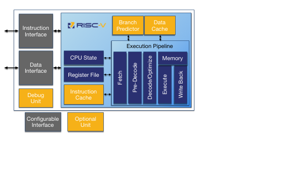

# RV12 RISC-V CPU Core

## Overview

The RV12 is a highly configurable single-issue, single-core RV32I, RV64I compliant RISC CPU intended for the embedded market. The RV12 is a member of the Roa Logic’s 32/64bit CPU family based on the industry standard [RISC-V instruction set](https://riscv.org/)

The RV12 implements a Harvard architecture for simultaneous instruction and data memory accesses. It features an optimizing folded 4-stage pipeline, which optimizes overlaps between the execution and memory accesses, thereby reducing stalls and improving efficiency.

Optional features include Branch Prediction, Instruction Cache, Data Cache, and Debug Unit. Parameterised and configurable features include the instruction and data interfaces, the branch-prediction-unit configuration, and the cache size, associativity, and replacement algorithms. Providing the user with trade offs between performance, power, and area to optimize the core for the application

## Documentation

- [Product Brief]()
- [RV12 Datasheet]()
- [User Guide]()

## Features

- Royalty Free Industry standard instruction set (www.riscv.org)
- Parameterized 32/64bit data
- Fast, precise interrupts
- Custom instructions enable integration of proprietary hardware accelerators
- Single cycle execution
- Optimizing folded 4-stage pipeline
- Optional/Parameterized branch-prediction-unit
- Optional/Parameterized caches

## Compatibility

The RV12 is compatible with the following RISC-V Foundation  specifications:

- User Mode Specifications 2.2
- Privilege Mode Specifications 1.9.1

## Interfaces

- AHB3 Lite
- Wishbone

## Parameters

The following parameters control the feature set of a specific implementation of the RV12:

| Parameter          | Type    | Default | Description                                                      |
| :----------------- | :-----: | :-----: | :--------------------------------------------------------------- |
| XLEN               | Integer | 32      | Datapath width                                                   |
| PC_INIT            | Address | ‘h200   | Program Counter Initialisation Vector                            |
| PHYS_ADDR_SIZE     | Integer | XLEN    | Physical Address Size                                            |
| HAS_USER           | Integer | 0       | User Mode Enable                                                 |
| HAS_SUPER          | Integer | 0       | Supervisor Mode Enable                                           |
| HAS_HYPER          | Integer | 0       | Hypervisor Mode Enable                                           |
| HAS_MULDIV         | Integer | 0       | “M” Extension Enable                                             |
| HAS_AMO            | Integer | 0       | “A” Extension Enable                                             |
| HAS_RVC            | Integer | 0       | “C” Extension Enable                                             |
| HAS_BPU            | Integer | 1       | Branch Prediction Unit Control Enable                            |
| IS_RV32E           | Integer | 0       | RV32E Base Integer Instruction Set Enable                        |
| MULT_LATENCY       | Integer | 0       | Hardware Multiplier Latency (if “M” Extension enabled)           |
| BP_LOCAL_BITS      | Integer | 10      | Number of local predictor bits                                   |
| BP_GLOBAL_BITS     | Integer | 2       | Number of global predictor bits                                  |
| HARTID             | Integer | 0       | Hart Identifier                                                  |
| ICACHE_SIZE        | Integer | 16      | Instruction Cache size in Kbytes                                 |
| ICACHE_BLOCK_SIZE  | Integer | 32      | Instruction Cache block length in bytes                          |
| ICACHE_WAYS        | Integer | 2       | Instruction Cache associativity                                  |
| ICACHE_REPLACE_ALG | Integer | 0       | Instruction Cache replacement algorithm                          |
| DCACHE_SIZE        | Integer | 16      | Data Cache size in Kbytes                                        |
| DCACHE_BLOCK_SIZE  | Integer | 32      | Data Cache block length in bytes                                 |
| DCACHE_WAYS        | Integer | 2       | Data Cache associativity                                         |

## Resources

Extract table from datasheet

## License

Released under the RoaLogic [Non-Commerical License](/LICENSE.md)

## Dependencies
Requires the Roa Logic [Memories IPs]() and [AHB3Lite Package](). These are included as submodules.
After cloning the RV12 git repository, perform a 'git submodule init' to download the submodules.
